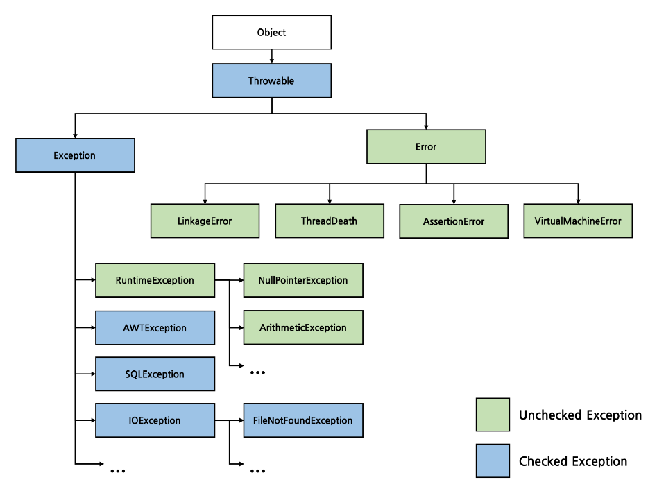

# Item 70 - 복구할 수 있는 상황에는 검사 예외를, 프로그래밍 오류에는 런타임 예외를 사용하라

## **예외의 종류 🧐**

> 예외는 `throwable` 타입이라고 한다.

예외는 **검사 예외**, **비검사 예외**가 있으며 비검사 예외의 하위에 런타임 예외와 에러가 있다.

- 검사 예외 (Checked Exception)
- 비검사 예외 (Unchecked Exception)
  - 런타임 예외 (Runtime Exception)
  - 에러 (Error)

## **검사 예외 🔎**

> 호출하는 쪽에서 복구하리라 예상되는 상황이라면 검사 예외를 사용하자.

- `Exception` 클래스의 하위 클래스이면서 `RuntimeException`을 상속하지 않는 예외 유형이다.
- 예상 가능하고 회복 가능한 상황에서 발생하는 오류를 나타낸다.
- 사용자에게 메소드의 실패 가능성을 명확하게 알려주며, 그 상황에 대응하도록 강제한다.
- `catch`로 잡아 처리하거나 밖으로 전파해서(`throws`) 처리할 수 있다.

> 가능하면, **복구에 필요한 정보를 알려주는 메서드**도 제공하자.

- 호출자가 예외 상황에서 벗어나는 데 필요한 정보를 제공해야 한다.
  - ex) 쇼핑몰에서 물건을 구입하려는 데 카드 잔고가 부족하여 검사 예외가 발생했다면?
  - 잔고가 얼마나 부족한지 알려주는 접근자 메서드를 제공해서 예외 상황을 벗어나게 한다.

## **비검사 예외 (런타임 예외, 에러)**

> 복구가 불가능하거나 더 실행해봐야 득보다는 실이 많을 때 사용한다.

- 명시적으로 처리하지 않아도 컴파일 오류가 발생하지 않는다.
- 프로그램의 정상적인 흐름에서는 발생하지 않아야 하므로, 발생할 경우 프로그램이 중단된다.
- ex) `NullPointerException`, `ArrayIndexOutOfBoundsException`, `OutOfMemoryError` … etc

### **런타임 예외**

> 프로그래밍 오류를 나타낼 때는 런타임 예외를 사용하자.

- `RuntimeException` 클래스를 상속받은 예외이다.
- 프로그램에서 지켜야 할 전제 조건을 위반할 때 발생한다.
- 사용자가 API 명세에 기록된 규칙이나 제약사항을 지키지 않았을 때 발생하는 오류이다.
  - ex) 배열에서 잘못된 인덱스에 접근한 경우 `ArrayIndexOutOfBoundsException`이 발생한다.

### **에러**

- JVM 수준에서 발생하는 심각하고 복구할 수 없는 문제를 나타내는데 사용한다.
- 따라서 애플리케이션 코드에서 에러를 처리하려는 시도를 하지 않아야 한다.
- 에러의 원인
  - ex) 자원 부족: JVM에 할당된 메모리를 초과하는 상황이 발생한 경우 `OutOfMemoryError`
  - ex) 재귀 호출로 인한 `StackOverflowError`

> 개발자가 구현하는 비검사 예외는 모두 `RuntimeException`의 하위 클래스여야 한다.

- `Error` 클래스를 상속받아 하위 클래스를 만들어서는 안된다.
- 뿐만 아니라, throw문으로 직접 던지는 일도 없어야 한다.
  - 왜냐하면 `Error`는 시스템 수준의 심각한 오류를 나타내기 위한 것이므로.

## **만들면 안되는 예외 🙅‍♂️**

> `Exception`, `RuntimeException`, `Error`를 상속하지 않는 throwable 은 만들지 않는 것이 좋다.

- 이런 throwable은 정상적인 검사 예외보다 나은게 없다.
- 오히려 사용자에게 혼란을 주고, 코드의 명확성과 유지 보수성을 해친다.

## **💡 핵심 정리**

- 복구할 수 있다면 검사 예외 (Checked Exception)
- 복구할 수 없다면 비검사 예외 (Unchecked Exception)
- 확실하지 않다면 비검사 예외 (Unchecked Exception)
- 검사 예외도 아니고 런타임 예외도 아닌 throwable 은 정의하지 말자.
- 검사 예외라면 복구에 필요한 정보도 제공해주자.
  - ex) 어떤 조치를 취하면 에러가 사라지는지.

## **👓 참고**
- [https://velog.io/@kdhyo/Java%EC%98%88%EC%99%B8Exception%EA%B4%80%EB%A0%A8-%EC%A0%95%EB%A6%AC](https://velog.io/@kdhyo/Java%EC%98%88%EC%99%B8Exception%EA%B4%80%EB%A0%A8-%EC%A0%95%EB%A6%AC)
