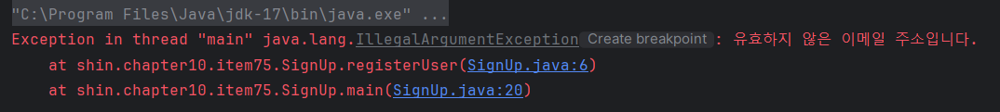
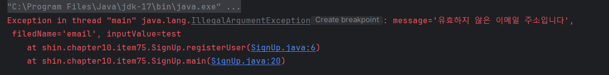
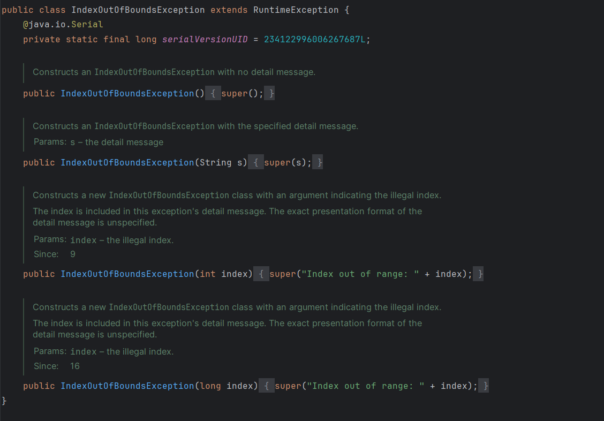

# Item75 - 예외의 상세 메시지에 실패 관련 정보를 담으라

## **스택 추적(stack trace)**



- 예외 객체의 `toString` 메서드를 호출해 얻은 문자열
- 일반적으로 예외 클래스 이름 뒤에 상세 메시지가 붙는 형태
- 프로그래머 혹은 신뢰성 엔지니어(SRE; Site Reliability Engineer)가 실패 원인을 분석하기 위한 유일한 정보인 경우가 많다.
- 실패를 재현하기 힘든 경우, 더 자세한 정보를 얻기가 어렵거나 불가능하다.
- `toString` 메서드에 실패 원인에 관한 정보를 가능한 한 많이 담아야 한다.

## **예외 상세 메시지에 담겨야 하는 정보**

> 스택 추적 정보는 많은 사람이 볼 수 있으므로 비밀번호나 암호 키 같은 보안 정보는 담지 마라.



- 예외에 관여된 모든 매개변수와 필드의 값을 실패 메시지에 담아라.
- 문서와 소스 코드에서 얻을 수 있는 정보까지 담을 필요는 없다.
    - 문제를 분석하는 사람은 관련 문서와 소스코드를 함께 살펴본다.
    - 스택 추적은 일반적으로 예외가 발생한 파일 이름과 줄번호, 스택에서 호출한 다른 메서드들의 파일 이름과 줄번호까지 정확히 기록한다.
- 예외 메시지는 가독성보다는 담긴 내용이 중요하다
    - 오류 메시지의 주 소비층인 최종 사용자에게는 친절한 안내 메시지를 보여줘야 한다
    - 예외 메시지의 주 소비층인 프로그래머와 SRE 엔지니어이에겐 정보의 질이 더 중요하다.
- 실패와 관련한 정보를 얻을 수 있는 접근자를 제공하는 것이 좋다. - *Item 70*
    - 예외 상황을 복구하는 데 유용할 수 있으므로 검사 예외에서 빛을 발한다.
    - 비검사 예외의 상세 정보에 프로그래밍 적으로 접근하는 프로그래머는 드물지라도, `toString` 규칙에 따라 상세 정보를 알려주는 접근자 메서드를 두는 것을 권한다.

## **IndexOutOfBoundsException**


IndexOutOfBoundsException은 아래와 같이 구현했어도 좋았을 것이다.

```java
/**
 * IndexOutOfBoundsException을 생성한다.
 *
 * @param lowerBound 인덱스의 최솟값
 * @param upperBound 인덱스의 최댓값 + 1
 * @param index 인덱스의 실젯값
 */
public IndexOutOfBoundsException(int lowerBound, int upperBound, int index) {
    // 실패를 포착하는 상세 메시지를 생성한다.
    super(String.format(
        "최솟값: %d, 최댓값: %d, 인덱스: %d",
        lowerBound, upperBound, index
    ));
    
    // 프로그램에서 이용할 수 있도록 실패 정보를 저장해둔다.
    this.lowerBound = lowerBound;
    this.upperBound = upperBound;
    this.index = index;
}
```
- Java 9에서는 정수 인덱스 값을 받는 생성자가 나오긴 했으나, 최솟값과 최댓값까진 받지 않는다.
- 최솟값, 최댓값, 범위를 벗어났다는 인덱스 값을 모두 담는 것이 좋았다.
    - 셋 중 한두 개, 혹은 셋 모두가 잘못됐을 수 있다. (내부 불변식이 심하게 깨진 경우)
    - 이상의 현상들은 모두 원인이 다르므로, 현상을 보면 무엇을 고쳐야 할 지 판단할 수 있다.
- 이렇게 해두면 프로그래머가 던지는 예외는 실패를 더 잘 포착하게 된다.
- 고품질 상세 메시지를 만들어내는 코드를 예외 클래스 안으로 모으므로, 클래스 사용자가 메시지를 따로 만드는 작업을 수반하지 않아도 된다.
