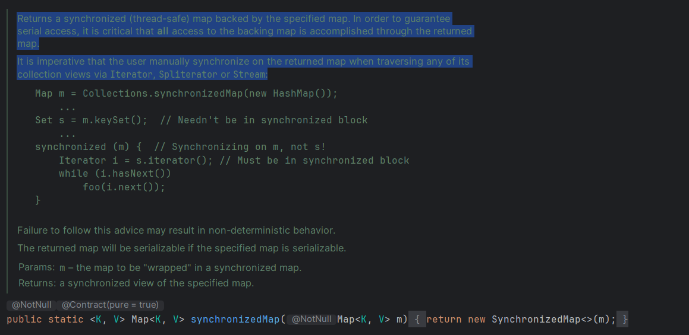

# Item 82 - 스레드 안전성 수준을 문서화하라

> 여러 스레드가 하나의 메서드를 동시에 호출할 때 **그 메서드가 어떻게 동작하느냐**는 클라이언트와 클래스 간의 중요한 계약과도 같다.

만약 API 문서에 아무런 언급이 없다면 사용자는 나름의 가정을 하고 사용해야 한다.

만약 이 가정이 틀린다면 프로그램은 심각한 오류로 이어질 수 있다. 😰

## **API 문서에 synchronized 한정자**

`synchronized` 한정자가 달려있는 메서드는 스레드 안전하다고 생각할 수 있다.

하지만 이는 몇 가지 면에서 틀렸다. 🙅‍♀️

- 자바독이 기본 옵션으로 생성한 API 문서에는 `synchronized` 한정자가 포함되지 않는다.
- 메서드 선언에 `synchronized` 한정자를 선언할지는 구현 이슈일 뿐 API에 속하지 않는다.

> 멀티스레드 환경에서도 API를 안전하게 사용하려면 클래스가 지원하는 스레드 안전성 수준을 정확히 명시해야 한다.

## **스레드 안전성 수준(높은 수준부터 나열)**

### **(1) 불변(immutabile)**

- 불변 클래스의 인스턴스는 마치 상수와 같아서 외부 동기화가 전혀 필요 없다.
- 스레드 안정성 애너테이션 - `@Immutable`
- ex. `String`, `Long`, `BigInteger` 등

### **(2) 무조건적 스레드 안전(unconditionally thread-safe)**

- 이 클래스의 인스턴스는 수정될 수 있으나, 내부에서 충실히 동기화하여 별도의 외부 동기화 없이 동시에 사용해도 안전하다.
- 스레드 안정성 애너테이션 - `@ThreadSafe`
- ex. `AtomicLong`, `ConcurrentHashMap` 등

### **(3) 조건부 스레드 안전(contiditionally thread-safe)**

- 무조건적 스레드 안전과 같으나, 일부 메서드는 동시에 사용하려면 외부 동기화가 필요하다.
- 스레드 안정성 애너테이션 - `@ThreadSafe`
- ex. `Collections.synchronized` 래퍼 메서드가 반환한 컬렉션들

### **(4) 스레드 안전하지 않음(not thread-safe)**

- 이 클래스들의 인스턴스는 수정될 수 있다.
- 동시에 사용하려면 클라이언트가 별도의 동기화를 수행해야 한다.
- 스레드 안정성 애너테이션 - `@NonThreadSafe`
- ex. `ArrayList`, `HashMap` 같은 기본 컬렉션

### **(5) 스레드 적대적(thread-hostile)**

- 이 클래스는 모든 메서드 호출을 외부 동기화로 감싸더라도 멀티스레드 환경에서 안전하지 않다.
- 이 수준의 클래스는 일반적으로 정적 데이터를 아무 동기화 없이 수정한다.
- 일반적으로 문제를 고쳐 재배포하거나, 자제(deprecated) API로 지정한다.
- ex. 아이템 78의 `generateSerialNumber` 메서드에 내부 동기화를 생략한 경우

## **조건부 스레드 안전 클래스 문서화시 주의사항**

> 어떤 순서로 호출할 때 외부 동기화가 필요한지, 그리고 그 순서로 호출하려면 어떤 락을 얻어야 하는지 알려줘야한다.

**`Collections.synchronizedMap` 예시**



- 클래스의 스레드 안전성은 보통 클래스의 문서화 주석에 기재하지만, 독특한 특성의 메서드라면 해당 메서드의 주석에 기재하도록 하자.
- 반환 타입만으로 명확히 알 수 없는 정적 팩터리라면 자신이 반환하는 객체의 스레드 안전성을 반드시 문서화해야 한다. (위 예시처럼)

## **공개 락 vs 비공개 락**

### **🔑 공개 락 : 외부에서 사용할 수 있는 락**

- 클라이언트에서 일련의 메서드 호출을 원자적으로 수행할 수 있다. (유연성 증가)
- 내부에서 처리하는 고성능 동시성 제어 메커니즘과 혼용할 수 없다.
    - `ConcurrentHashMap` 같은 동시성 컬렉션과는 함께 사용할 수 없다.
- 서비스 거부 공격(denial-of-service attack)에 취약하다.
    - 클라이언트가 공개된 락을 오래 쥐고 놓치 않는 공격

### **🔒 비공개 락**

> 서비스 거부 공격을 막으려면 비공개 락 객체를 사용해야 한다.

```java
// 락 객체가 교체되는 걸 방지하기 위해 final, 외부에서 못보게 private
private final Object lock = new Object();

public void foo() {
    synchronized(lock) {
        ...
    }
}
```
- 비공개 락 객체는 클래스 바깥에서 볼 수 없으니 클라이언트가 동기화에 관여할 수 없다.
- 아이템 15의 조언에 따라 락 객체를 동기화 대상 객체 안으로 캡슐화했다.
- 락 객체는 반드시 `final`로 선언하라.
    - 우연히라도 락 객체가 교체되는 일을 예방해준다.
- 비공개 락 객체 관용구는 무조건적 스레드 안전 클래스에서만 사용할 수 있다.
    - 조건부 스레드 안전 클래스에서는 특정 호출 순서에 필요한 락이 무엇인지 클라이언트에게 알려줘야 하므로 사용할 수 없다.

## **💡 핵심 정리**
- 모든 클래스는 스레드 안정성 정보를 명확하게 문서화해야 한다.
- synchronized 한정자는 문서화와 관련이 없다.
- 조건부 스레드 안전 클래스는 메서드를 어떤 순서로 호출할 때 외부 동기화가 요구되고, 어떤 락을 얻어야 하는지 문서화해야 한다.
- 무조건적 스레드 안전 클래스는 `synchronized` 메서드가 아닌 비공개 락 객체를 사용하자.
    - 클라이언트나 하위 클래스에서 동기화 메커니즘을 깨뜨리는 걸 예방할 수 있다.
