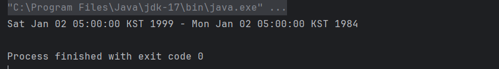
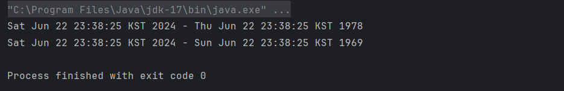
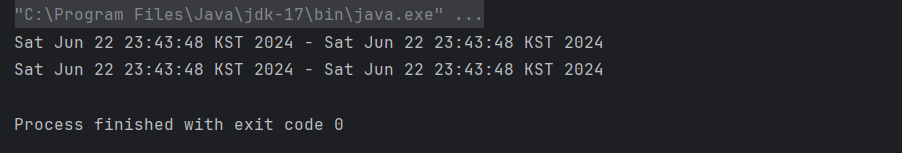

## **readObject 메서드**
- `ObjectInputStream` / `ObjectOutputStream` 를 통해 객체를 파일에 읽고 쓴다.
- 이 클래스에 포함된 메서드가 `readObject()` / `writeObject()`이다.
- 클래스에 `readObject()` / `writeObject()` 가 정의되어 있다면, 기본 직렬화 과정에서 이 메서드를 통해 직렬화와 역직렬화를 수행한다.
    - 커스텀한 직렬화 (직렬화에 특정 처리를 하고 싶을 때) 사용.
    - private 메서드로 작성해야 한다.
    - 이 메서드들의 처음에 `defaultWriteObject()` / `defaultReadObject()` 를 호출하여 기본 직렬화를 실행하게 해야한다.
    - 리플렉션을 통해 작업을 수행한다.

## **readObject 메서드의 문제점**
- readObject 메서드는 실질적으로 또 다른 public 생성자이다.
- 따라서, 생성자처럼 **유효성검사**, **방어적 복사**를 수행해야한다.
    - 그렇지 않으면, 불변식을 보장하지 못한다.

## **불변식을 보장하지 못하는 사례 (1) : Period 클래스 유효성 검사**

아래의 코드는 `readObject`를 따로 정의하지 않아서, 자바의 기본 직렬화를 수행한다.

```java
public final class Period implements Serializable { 
    private Date start;
    
    private Date end;
    
    // 수정한 생성자 - 매개변수의 방어적 복사본을 만든다.
    public Period(Date start, Date end) {
        this.start = new Date(start.getTime()); // 방어적 복사
        this.end = new Date(end.getTime());
        
        if (this.start.compareTo(this.end) > 0) { // 유효성 검사
            throw new IllegalArgumentException(start + " after " + end);
        }
   }

   // 수정한 접근자 - 가변 필드의 방어적 복사본을 만든다.
   public Date start() {
       return new Date(start.getTime());
   }

   public Date end() {
       return new Date(end.getTime());
   }
   
   @Override
   public String toString() { return start + " - " + end; }
}
```

`readObject`는 매개변수로 바이트스트림을 받는 생성자라 할 수 있다.

보통의 경우, 바이트스트림은 정상적으로 생성된 인스턴스를 직렬화해 만들어진다.

만약 아래와 같은 **바이트스트림**을 `Period` 객체로 역직렬화한다면?

```java
public class BogusPeriod {
    // 불변식을 깨뜨리도록 조작된 바이트 스트림
    private static final byte[] serializedForm = new byte[] {
            (byte)0xac, (byte)0xed, 0x00, 0x05, 0x73, 0x72, 0x00, 0x06,
            0x50, 0x65, 0x72, 0x69, 0x6f, 0x64, 0x40, 0x7e, (byte)0xf8,
            0x2b, 0x4f, 0x46, (byte)0xc0, (byte)0xf4, 0x02, 0x00, 0x02,
            0x4c, 0x00, 0x03, 0x65, 0x6e, 0x64, 0x74, 0x00, 0x10, 0x4c,
            0x6a, 0x61, 0x76, 0x61, 0x2f, 0x75, 0x74, 0x69, 0x6c, 0x2f,
            0x44, 0x61, 0x74, 0x65, 0x3b, 0x4c, 0x00, 0x05, 0x73, 0x74,
            0x61, 0x72, 0x74, 0x71, 0x00, 0x7e, 0x00, 0x01, 0x78, 0x70,
            0x73, 0x72, 0x00, 0x0e, 0x6a, 0x61, 0x76, 0x61, 0x2e, 0x75,
            0x74, 0x69, 0x6c, 0x2e, 0x44, 0x61, 0x74, 0x65, 0x68, 0x6a,
            (byte)0x81, 0x01, 0x4b, 0x59, 0x74, 0x19, 0x03, 0x00, 0x00,
            0x78, 0x70, 0x77, 0x08, 0x00, 0x00, 0x00, 0x66, (byte)0xdf,
            0x6e, 0x1e, 0x00, 0x78, 0x73, 0x71, 0x00, 0x7e, 0x00, 0x03,
            0x77, 0x08, 0x00, 0x00, 0x00, (byte)0xd5, 0x17, 0x69, 0x22,
            0x00, 0x78
    };

    public static void main(String[] args) {
        Period p = (Period)deserialize(serializedForm);
        System.out.println(p);
    }

    private static Object deserialize(byte[] sf) {
        try (InputStream is = new ByteArrayInputStream(sf);
             ObjectInputStream ois = new CustomObjectInputStream(is)) {
            return ois.readObject();
        } catch (Exception e) {
            throw new IllegalArgumentException(e);
        }
    }

    private static class CustomObjectInputStream extends ObjectInputStream {
        public CustomObjectInputStream(InputStream in) throws Exception {
            super(in);
        }

        @Override
        protected Class<?> resolveClass(ObjectStreamClass desc) throws IOException, ClassNotFoundException {
            String name = desc.getName();
            if ("Period".equals(name)) {
                return shin.chapter12.item88.Period.class;
            }
            return super.resolveClass(desc);
        }
    }
}
```

- 위 바이트스트림의 정보는 **start시각**이 **end시각**보다 **느리게** 조작했다.
- 즉, 불변식을 깨뜨리는 객체로 역직렬화 되도록 조작되었다.



### **해결방법 🔨**

- `readObject` 를 정의하고, 유효성 검사를 실시한다.
- `Period` 클래스에 다음의 메서드를 추가한다.

```java
private void readObject(ObjectInputStream s) throws IOException, ClassNotFoundException {
    s.defaultReadObject(); // 기본 직렬화 수행
    
    // 불변식을 만족하는지 검사한다. 유효성 검사
    if (start.compareTo(end) > 0) { 
        throw new InvalidObjectException(start + " 가 " + end + " 보다 늦다.");
    }
}
```

## **불변식을 보장하지 못하는 사례 (2) : Period 클래스 방어적 복사**

정상 Period 인스턴스에서 시작된 바이트 스트림 끝에 (직렬화된 바이트 스트림 끝에)

private Date 필드 참조를 추가하면 가변 Period 인스턴스를 만들 수 있다.

```java
public class MutablePeriod {
	 // Period 인스턴스
   public final Period period;
	 // 시작 시각 필드 - 외부에서 접근할 수 없어야 한다.
   public final Date start;
	 // 종료 시각 필드 - 외부에서 접근할 수 없어야 한다.
   public final Date end;

   public MutablePeriod() {
       try {
           ByteArrayOutputStream bos = new ByteArrayOutputStream();
           ObjectOutputStream out = new ObjectOutputStream(bos);

           // 불변식을 유지하는 Period 인스턴스를 직렬화
           out.writeObject(new Period(new Date(), new Date()));

           /*
            * 악의적인 '이전 객체 참조', 즉 내부 Date 필드로의 참조를 추가한다.
            */
           byte[] ref = { 0x71, 0, 0x7e, 0, 5 }; // 악의적인 참조
           bos.write(ref); // 시작(start) 필드 참조 추가
           ref[4] = 4; // 악의적인 참조
           bos.write(ref); // 종료(end) 필드 참조 추가

           // 역직렬화 과정에서 Period 객체의 Date 참조를 훔친다.
           ObjectInputStream in = new ObjectInputStream(new ByteArrayInputStream(bos.toByteArray()));
           period = (Period) in.readObject();
           start = (Date) in.readObject();
           end = (Date) in.readObject();
       } catch (IOException | ClassNotFoundException e) {
           throw new AssertionError(e);
       }
   }
}
```

```java
public static void main(String[] args) {
    MutablePeriod mp = new MutablePeriod();
    Period mutablePeriod = mp.period; // 불변 객체로 생성한 Period
    Date pEnd = mp.end; // MutablePeriod 클래스의 end 필드

		// 시간을 되돌리자!
    pEnd.setYear(78); // MutablePeriod 의 end 를 바꿨는데 ?
    System.out.println(p); // Period 의 값이 바뀐다.

		// 60년대로 회귀
    pEnd.setYear(69);
    System.out.println(p);
}
```


- 불변 객체 `Period` 를 직렬화 / 역직렬화한다고 생각할 수 있지만,
- 위의 방법으로 불변식을 깨뜨릴 수 있다.
- 실제로 `String`이 불변이라는 사실에 기댄 보안 문제들이 존재한다.

### **해결방법 🔨**

- 객체를 역직렬화할 때는 **클라이언트가 소유하면 안 되는 객체 참조를 갖는 필드를 모두 방어적 으로 복사해야 한다.**
- `readObject`에서는 불변 클래스 안의 모든 private 가변 요소를 방어적 복사해야 한다.

```java
private void readObject(ObjectInputStream s) throws IOException, ClassNotFoundException {
   s.defaultReadObject();

   // 가변 요소들을 방어적으로 복사한다.
   start = new Date(start.getTime());
   end = new Date(end.getTime());

	 // 불변식을 만족하는지 검사한다. (유효성 검사)
   if (start.compareTo(end) > 0)
       throw new InvalidObjectException(start +" after "+ end);
}
```


- 방어적 복사를 유효성 검사보다 앞서 수행하자.
    - 반대라면, **유효성 검사 ~ 방어적 복사** 사이에 불변식을 깨뜨릴 틈이 생긴다. (item 50)
- final 필드는 방어적 복사가 불가능하므로 주의하자.
    - start와 end의 final 한정자를 제거했다.


## **기본 readObject와 커스텀 readObject의 선택 기준**

> **Q. `transient` 필드를 제외한 모든 필드의 값을 매개변수**로 받아 **유효성 검사 없이 필드에 대입하는 `public` 생성자**를 추가해도 괜찮은지를 기준으로 생각해보자.

Yes 🙆 : **기본 `readObject`**

No 🙅‍♀️ : **직렬화 프록시 패턴사용 or 커스텀 `readObject` 를 만들어 유효성 검사와 방어적 복사 수행**

## **마지막 팁**

`readObject` 메서드에서 재정의 가능 메서드를 호출하면 안된다. (item 19)

- 클래스가 final이 아닌 경우에만 해당
- 하위 클래스의 상태가 역직렬화되기 전에 하위 클래스에서 재정의된 메서드가 실행될 수 있고, 이는 프로그램 오작동으로 이어질 수 있다.

## **💡 핵심 정리**

- `readObject` 메서드를 작성할 때는 언제나 public 생성자를 작성하는 자세로 임해야 한다.
- `readObject` 는 어떤 바이트 스트림이 넘어오더라도 유효한 인스턴스를 만들어내야 한다.
- 바이트 스트림이 진짜 직렬화된 인스턴스라고 가정해서는 안 된다.
- 안전한 readObject 메서드를 작성하는 지침
    - private 이어야 하는 객체 참조 필드는 각 필드가 가리키는 객체를 방어적으로 복사하자.
    - 모든 불변식을 검사하여 어긋나는 게 발견되면 `InvalidObjectException`을 던진다.
    - 방어적 복사 후에는 반드시 불변식 검사가 뒤따라야 한다.
    - 역직렬화 후 객체 그래프 전체의 유효성을 검사해야 한다면 `ObjectInputValidation` 인터페이스를 사용해라.
    - 직접적이든 간접적이든, 재정의할 수 있는 메서드는 호출하지 말자.
