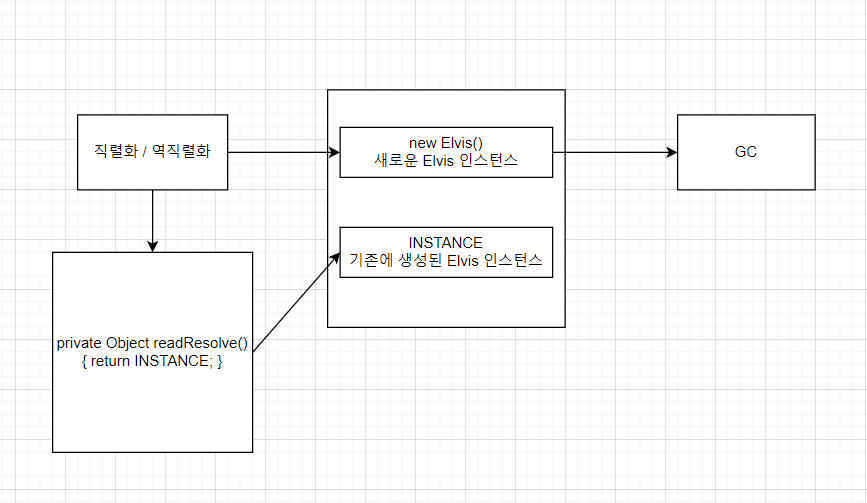
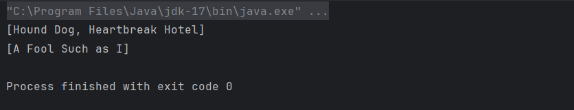

## **싱글턴 패턴과 직렬화**

## **진짜 싱글턴일까? ,,, No(🙅)**

```java
public class Elvis {
		public static final Elvis INSTANCE = new Elvis();
		private Elvis() { ... }

		public void leaveTheBuilding() { ... }
}

```

- 이 클래스는 바깥에서 생성자를 호출하지 못하게 막는 방식(private)으로 인스턴스가 오직 하나만 만들어짐을 보장했다.
- item 3에서 이야기했듯, 이 클래스는 선언에 implements Serializable을 추가하는 순간 **싱글턴이 아니게 된다.**
- 기본 직렬화를 쓰지 않더라도(item87), 명시적인 `readObject`를 제공하더라도(item88) 싱글턴이 아니다.
- 어떤 `readObject`를 사용하든간에 이 클래스가 초기화될 때 만들어진 인스턴스와는 별개의 인스턴스를 반환하게 된다.

## **싱글턴 속성을 유지하는 방법 - readResolve**

- `readResolve`를 사용하면 ****`readObject`가 만들어낸 인스턴스를 다른 것으로 대체할 수 있다.
- 역직렬화 후 새로 생성된 객체를 인수로 `readResolve` 메서드가 호출되고, 이 메서드가 반환한 객체 참조가 새로 생성된 객체를 대신해 반환된다.
- 이 때 새로 생성된 객체의 참조는 유지하지 않으므로 GC의 대상이 된다.



```java
// 진짜 Elvis를 반환하고, 가짜는 알아서 GC에 맡겨짐
private Object readResolve() {
		// 기존에 생성된 인스턴스를 반환한다.
		return INSTANCE;
}

```

- 이 메서드는 역직렬화한 객체는 무시하고 클래스 초기화 때 만들어진 Elvis 인스턴스를 반환한다.
- Elvis 인스턴스 직렬화 형태는 실 데이터를 가질 이유가 없으니 모든 인스턴스 필드를 transient로 선언해야 한다.

## **필드를 trainseint로 선언하지 않으면 발생하는 취약점**

> `readResolve`를 인스턴스 통제 목적으로 사용한다면 객체 참조 타입 인스턴스 필드는 모두 transient로 선언해야 한다.
- ***이렇게 하지 않으면 역직렬화된 객체 참조를 공격할 여지가 남는다.***
>

공격 방법에 대한 아이디어는 간단하다.

1. `readResolve` 메서드와 인스턴스 필드 하나를 포함한 **도둑 클래스**를 만든다.
2. 도둑 클래스의 인스턴스 필드는 직렬화된 싱글턴을 참조하는 역할을 한다.
3. 직렬화된 스트림에서 싱글턴의 비휘발성 필드를 도둑의 인스턴스 필드로 교체한다.
4. 싱글턴이 도둑을 포함하므로 **역직렬화시 도둑 클래스의 `readResolve`가 먼저 호출**된다.
5. 도둑 클래스의 인스턴스 필드에는 역직렬화 도중의 싱글턴의 참조가 담겨있게 된다.
6. 도둑 클래스의 `readResolve` 메서드는 인스턴스 필드가 참조한 값을 정적 필드로 복사한다.
7. 싱글턴은 도둑이 숨긴 transient가 아닌 필드의 원래 타입에 맞는 값을 반환한다.
8. 이 과정을 생략하면 직렬화 시스템이 도둑의 참조를 이 필드에 저장하려 할 때 `ClassCastException`이 발생한다.

다음은 이 문제점을 구체적인 코드로 나타낸다.

```java
// transient 가 아닌 참조 필드를 가지는 싱글턴
public class Elvis implements Serializable {
    private static final long serialVersionUID = -8870240565519414478L;

    public static final Elvis INSTANCE = new Elvis();
    
    private String[] favoriteSongs = {"Hound Dog", "Heartbreak Hotel"};

    private Elvis() {
    }

    public void printFavorites() {
        System.out.println(Arrays.toString(favoriteSongs));
    }

    private Object readResolve() throws ObjectStreamException {
        return INSTANCE;
    }
}
```

```java
// 싱글턴의 비휘발성 인스턴스 필드를 훔쳐러는 도둑 클래스
public class ElvisStealer implements Serializable {
    private static final long serialVersionUID = 0;

    static Elvis impersonator;
    
    private Elvis payload;

    private Object readResolve() {
        // resolve 되기 전의 Elvis 인스턴스의 참조를 저장한다.
        impersonator = payload;

        // favoriteSongs 필드에 맞는 타입의 객체를 반환한다.
        return new String[] {"A Fool Such as I"};
    }
}

```

```java
// 직렬화의 약점을 이용해 싱글턴 객체를 2개 생성한다.
public class ElvisImpersonator {
    
    // 진짜 Elvis 인스턴스로는 만들어질 수 없는 바이트 스트림 !
    private static final byte[] serializedForm = new byte[] {
            (byte)0xac, (byte)0xed, 0x00, 0x05, 0x73, 0x72, 0x00, 0x05,
            0x45, 0x6c, 0x76, 0x69, 0x73, (byte)0x84, (byte)0xe6,
            (byte)0x93, 0x33, (byte)0xc3, (byte)0xf4, (byte)0x8b,
            0x32, 0x02, 0x00, 0x01, 0x4c, 0x00, 0x0d, 0x66, 0x61, 0x76,
            0x6f, 0x72, 0x69, 0x74, 0x65, 0x53, 0x6f, 0x6e, 0x67, 0x73,
            0x74, 0x00, 0x12, 0x4c, 0x6a, 0x61, 0x76, 0x61, 0x2f, 0x6c,
            0x61, 0x6e, 0x67, 0x2f, 0x4f, 0x62, 0x6a, 0x65, 0x63, 0x74,
            0x3b, 0x78, 0x70, 0x73, 0x72, 0x00, 0x0c, 0x45, 0x6c, 0x76,
            0x69, 0x73, 0x53, 0x74, 0x65, 0x61, 0x6c, 0x65, 0x72, 0x00,
            0x00, 0x00, 0x00, 0x00, 0x00, 0x00, 0x00, 0x02, 0x00, 0x01,
            0x4c, 0x00, 0x07, 0x70, 0x61, 0x79, 0x6c, 0x6f, 0x61, 0x64,
            0x74, 0x00, 0x07, 0x4c, 0x45, 0x6c, 0x76, 0x69, 0x73, 0x3b,
            0x78, 0x70, 0x71, 0x00, 0x7e, 0x00, 0x02
    };

    public static void main(String[] args) {
        // ElvisStealer.impersonator 를 초기화한 다음,
        // 진짜 Elvis(즉, Elvis.INSTANCE)를 반환
        Elvis elvis = (Elvis)deserialize(serializedForm);
        Elvis impersonator = ElvisStealer.impersonator;

        elvis.printFavorites(); // [Hound Dog, Heartbreak Hotel]
        impersonator.printFavorites(); // [There is no cow level]
    }

    // 주어진 직렬화 형태(바이트 스트림)로부터 객체를 만들어 반환한다.
    private static Object deserialize(byte[] sf) {
        try (InputStream is = new ByteArrayInputStream(sf);
             ObjectInputStream ois = new ElvisImpersonator.CustomObjectInputStream(is)) {
            return ois.readObject();
        } catch (Exception e) {
            throw new IllegalArgumentException(e);
        }
    }

    private static class CustomObjectInputStream extends ObjectInputStream {
        public CustomObjectInputStream(InputStream in) throws IOException {
            super(in);
        }

        @Override
        protected Class<?> resolveClass(ObjectStreamClass desc) throws IOException, ClassNotFoundException {
            String name = desc.getName();

            if ("ElvisStealer".equals(name)) {
                return shin.chapter12.item89.ElvisStealer.class;
            }

            if ("Elvis".equals(name)) {
                return shin.chapter12.item89.Elvis.class;
            }

            return super.resolveClass(desc);
        }
    }
}
```


## **해결방법 🔨 - 열거 타입(enum)**

> 직렬화 가능한 인스턴스 통제 클래스를 열거 타입을 이용해 구현하면 선언한 상수 외의 다른 객체는 존재하지 않음을 자바가 보장해준다. 
> (`AccessibleObject.setAccessible` 메서드 같은 리플렉션을 사용한 것은 제외하고)


다음과 같이 **열거 타입**(enum)으로 만들어진 `Elvis`는 전통적인 싱글턴보다 우수하다.

```java
public enum Elvis {
    INSTANCE;

    private String[] favoriteSongs = { "Hound Dog", "Heartbreak Hotel" };

    public void printFavorites() {
        System.out.println(Arrays.toString(favoriteSongs));
    }
}

```

### **readResolve를 사용하는 방식이 필요할 때도 있다.**

- 직렬화 가능 인스턴스 통제 클래스를 작성할 때, 컴파일 타임에 어떤 인스턴스들이 있는 지 알 수 없는 상황이라면 열거 타입으로 표현하는 것이 불가능하기 때문이다.

### **readResolve 메서드의 접근성**

- final 클래스에서라면 `readResolve` 메서드는 private 이어야 한다.
- final이 아닌 클래스에서는 다음의 몇 가지를 주의해서 고려해야 한다.
    - private으로 선언하면 하위 클래스에서 사용할 수 없다.
    - package-private으로 선언하면 같은 패키지에 속한 하위 클래스에서만 사용할 수 있다.
    - protected나 public으로 선언하면 이를 재정의하지 않은 모든 하위 클래스에서 사용할 수 있다.
    - protected나 public이면서 하위 클래스에서 재정의하지 않았다면, 하위 클래스의 인스턴스를 역직렬화하면서 상위 클래스의 인스턴스를 생성하여 `ClassCastException`을 일으킬 수 있다.

## **💡 핵심 정리**

- 불변식을 지키기 위해 인스턴스를 통제해야 한다면 가능한 한 열거 타입을 사용하자.
- 열거 타입 사용이 여의치 않은 상황에 직렬화와 인스턴스 통제가 모두 필요하다면 `readResolve` 메서드를 사용하자.
- 단, 그 클래스의 모든 참조 타입 인스턴스 필드에 transient 한정자를 선언해야 한다.
