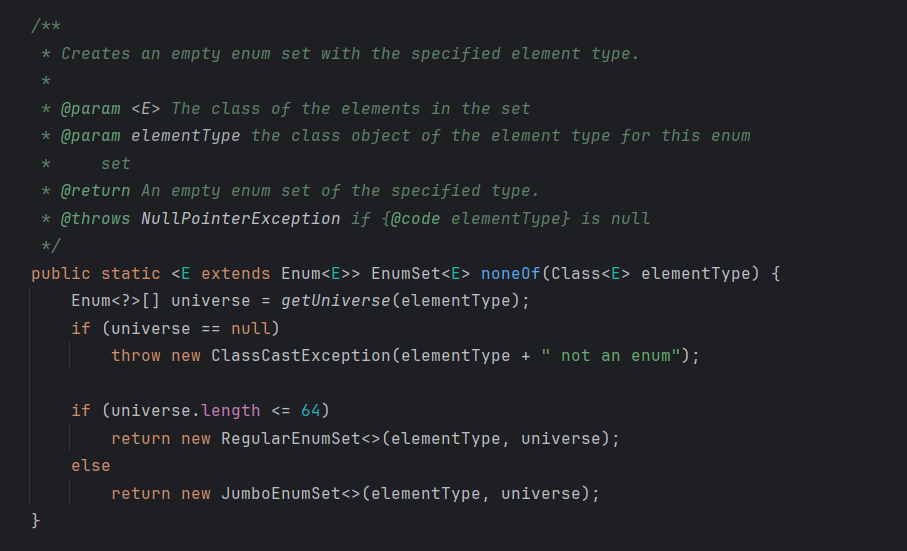

# Item 90 - 직렬화된 인스턴스 대신 직렬화 프록시 사용을 검토하라

`Serializable`을 구현하는 순간, 생성자 이외의 방법으로 인스턴스를 생성할 수 있게 된다.

이전 아이템에서도 계속 언급되지만, 버그와 보안 문제가 일어날 가능성이 커진다.

하지만 **직렬화 프록시 패턴**을 사용하면 이 위험을 크게 줄일 수 있다.

## **직렬화 프록시 패턴**

```java
public final class Period implements Serializable {
    // 불변 가능
    private final Date start;
    private final Date end;

    public Period(Date start, Date end) {
        this.start = new Date(start.getTime());
        this.end = new Date(end.getTime());

        if (this.start.compareTo(this.end) > 0) {
            throw new IllegalArgumentException(
                    start + " after " + end);
        }
    }

    public Date start() {
        return new Date(start.getTime());
    }

    public Date end() {
        return new Date(end.getTime());
    }

    public String toString() {
        return start + " - " + end;
    }

    // 바깥 클래스의 논리적 상태를 정밀하게 표현하는 중첩 클래스(Period 클래스의 직렬화 프록시)
    private static class SerializationProxy implements Serializable {
        private static final long serialVersionUID = 234098243823485285L; // Any number will do (Item 87)
        private final Date start;
        private final Date end;

        // 생성자는 단 하나여야 하고, 바깥 클래스의 인스턴스를 매개변수로 받고 데이터를 복사해야 함
        SerializationProxy(Period p) {
            this.start = p.start;
            this.end = p.end;
        }

        // 역직렬화시 직렬화 시스템이 직렬화 프록시를 다시 바깥 클래스의 인스턴스로 변환하게 해줌.
        // 역직렬화는 불변식을 깨뜨릴 수 있다는 불안함이 있는데,
        // 이 메서드가 불변식을 깨뜨릴 위험이 적은 정상적인 방법(생성자, 정적 팩터리, 다른 메서드를 사용)으로 역직렬화된 인스턴스를 얻게 한다.
        // "역직렬화 하려면 이거로 대신해"
        private Object readResolve() {
            return new Period(start, end);    // public 생성자를 사용한다.
        }
    }
    
    // 직렬화 프록시 패턴용 writeReplace 메서드
    // 자바의 직렬화 시스템이 바깥 클래스의 인스턴스 말고 SerializationProxy의 인스턴스를 반환하게 하는 역할
    // 이 메서드 덕분에 직렬화 시스템은 바깥 클래스의 직렬화된 인스턴스를 생성해낼 수 없다.
    // "프록시야 너가 대신 직렬화되라"
    private Object writeReplace() {
        return new SerializationProxy(this);
    }

    // 직렬화 프록시 패턴용 readObject 메서드
    // 불변식을 훼손하고자 하는 시도를 막을 수 있는 메서드
    // "Period 인스턴스로 역직렬화를 하려고해? 안돼"
    private void readObject(ObjectInputStream stream)
            throws InvalidObjectException {
        // 역직렬화 시도 시, 에러반환
        throw new InvalidObjectException("프록시가 필요합니다");
    }
}
```
- 가짜 바이트 스트림 공격과 내부 필드 탈취 공격을 프록시 수준에서 차단해준다
- 필드들을 `final`로 선언해도 되므로 `Period`클래스를 진정한 불변으로 만들 수 있다.
- 역직렬화때 유효성 검사를 하지 않아도 된다
- 역직렬화한 인스턴스와 원래의 직렬화된 인스턴스의 클래스가 달라도 정상 작동한다.

## **EnumSet (Item 36)**

`EnumSet`은 생성자 없이 정적 팩터리들만 제공한다.

- 단순히 생각하면 `EnumSet` 인스턴스를 반환하는 것 같지만, 열거 타입의 크기에 따라 다르다.
- 열거 타입의 원소의 개수가
    - 64개 이하면, `RegularEnumSet`을 반환
    - 그보다 크면, `JumboEnumSet`을 반환



### **시나리오**

- 64개의 열거타입을 가진 EnumSet을 직렬화하자.
- 그리고 원소 5개를 추가해 역직렬화하자.

처음 직렬화된 것은 `RegularEnumSet` 인스턴스 였다가,
역직렬화는 `JumboEnumSet`로 하는 것이 더 효율적이고 좋을 것이다.

- 직렬화 프록시를 이용하면, 원하는 방향대로 사용이 가능하다.
- 아래는 `EnumSet`의 실제 코드 - **직렬화 프록시 패턴**을 이용

```java
private static class SerializationProxy<E extends Enum<E>>
    implements java.io.Serializable
{

    private static final Enum<?>[] ZERO_LENGTH_ENUM_ARRAY = new Enum<?>[0];

    // EnumSet의 원소 타입
    private final Class<E> elementType;
    
    // EnumSet 내부 원소
    private final Enum<?>[] elements;

    SerializationProxy(EnumSet<E> set) {
        elementType = set.elementType;
        elements = set.toArray(ZERO_LENGTH_ENUM_ARRAY);
    }
		
    // 원소의 크기에 맞는 EnumSet 생성
    @SuppressWarnings("unchecked")
    private Object readResolve() {
        EnumSet<E> result = EnumSet.noneOf(elementType);
        for (Enum<?> e : elements)
            result.add((E)e);
        return result;
    }

    private static final long serialVersionUID = 362491234563181265L;
}

Object writeReplace() {
    return new SerializationProxy<>(this);
}

private void readObject(java.io.ObjectInputStream s)
    throws java.io.InvalidObjectException {
    throw new java.io.InvalidObjectException("Proxy required");
}
```

## **직렬화 프록시 패턴의 한계**

- 클라이언트가 멋대로 확장할 수 있는 클래스에는 적용할 수 없다.
- 객체그래프 순환이 있는 클래스에는 적용할 수 없다.
- 방어적 복사보다 느리다.

## **💡 핵심 정리**

- 제3자가 확장할 수 없는 클래스라면 가능한 직렬화 프록시 패턴을 사용하자.
