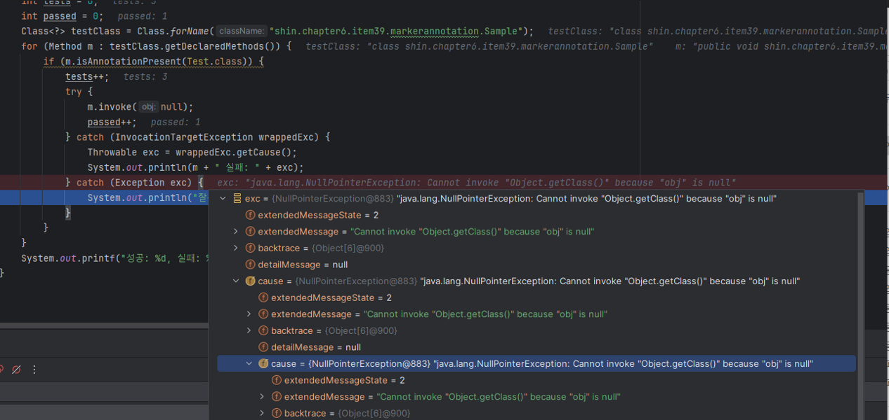

# Item 39 - 명명 패턴보다 애너테이션을 사용하라

## 명명패턴

전통적으로 도구나 프레임워크가 다뤄야 할 프로그램 요소에는

딱 구분되는 명명 패턴을 적용해왔다.

테스트 프레임워크인 Junit3 버전을 확인해보자.

https://github.com/stefanbirkner/junit3/blob/master/junit/framework/TestSuite.java

### junit3.junit.framework.TestSuite 클래스

```java
public class TestSuite implements Test {
    private boolean isTestMethod(Method m) {
        String name= m.getName();
        Class[] parameters= m.getParameterTypes();
        Class returnType= m.getReturnType();
        return parameters.length == 0 && name.startsWith("test") && returnType.equals(Void.TYPE);
    }
}
```

테스트 메서드 여부를 판단할 때, 메서드명이 **test로 시작하는지**를 체크한다.

효과적인 방법이지만 단점도 크다.

### 명명 패턴 단점

1. 오타가 나면 안된다.

   ex) JUnit3에서 메서드 이름을 tsetSafetyOverride로 지으면, 해당 메서드를 무시하고 지나치며,
   개발자는 테스트가 통과했다고 오해할 수 있다.

2. 올바른 프로그램 요소에서만 사용된다는 보장이 없다.

   ex) JUnit3에서 클래스 이름을 TestXxxx로 지어 해당 클래스 내부 메서드를 테스트하고 싶어도, Junit은 경고 메시지도 없이 해당 클래스 메서드 테스트를 수행하지 않고 넘어간다.

3. 프로그램 요소를 매개변수로 전달할 마땅한 방법이 없다.

   ex) 특정 예외를 던져야만 성공하는 테스트가 있을 때, 테스트할 방법이 없다.


---

## 애너테이션

애너테이션은 명명 패턴의 모든 단점을 해결할 수 있으며, JUnit4 부터 애너테이션을 전면 도입했다.

### 테스트 프레임워크를 직접 만들어보면서 애너테이션 동작방식을 이해해보자.

```java
import java.lang.annotation.*;

/**
 * 테스트 메서드임을 선언하는 애너테이션이다.
 * 매개변수 없는 정적 메서드 전용이다.
 */
@Retention(RetentionPolicy.RUNTIME)
@Target(ElementType.METHOD)
public @interface Test {
}
```

위 @Test 애너테이션은 자동으로 수행되는 간단한 테스트 용으로, 예외가 발생하면 해당 테스트를 실패로 처리한다.

이 애너테이션을 사용하면 프로그래머가 Test 이름에 오타를 내거나 메서드 선언 외의 프로그램 요소에 달면 컴파일 오류를 내준다.

### 메타 애너테이션

애너테이션 선언에 다는 애너테이션

- @Retention(RetentionPolicy.RUNTIME) : 런타임시에도 유지되어야 한다.
- @Target(ElementType.METHOD) : 메서드 선언에서만 사용되어야 한다.

### 마커 애너테이션

아무 매개변수 없이 단순히 대상에 마킹

- 실제 클래스에 직접적인 영향을 주지는 않으며, 애너테이션에 관심있는 프로그램에 추가 정보를 제공해준다.
- 대상 코드의 의미는 그대로 둔 채, 그 애너테이션에 관심 있는 도구에서 특별한 처리를 할 수 있게 해준다.

### 마커 애너테이션 활용 예시

```java
public class Sample {
    @Test public static void m1() { } // 성공
    
    @Test public static void m2() {
        throw new RuntimeException("실패");
    }

    @Test public void m3() { }   // 잘못 사용한 예: 정적 메서드가 아니다.
		
    public static void m4() { } // 테스트가 아니다.
}
```

```java
import java.lang.reflect.InvocationTargetException;
import java.lang.reflect.Method;

public class RunTests {
    public static void main(String[] args) throws Exception {
        int tests = 0;
        int passed = 0;
        Class<?> testClass = Class.forName("shin.chapter6.item39.markerannotation.Sample");
        for (Method m : testClass.getDeclaredMethods()) {
            if (m.isAnnotationPresent(Test.class)) {
                tests++;
                try {
                    m.invoke(null);
                    passed++;
                } catch (InvocationTargetException wrappedExc) {
                    Throwable exc = wrappedExc.getCause();
                    System.out.println(m + " 실패: " + exc);
                } catch (Exception exc) {
                    System.out.println("잘못 사용한 @Test: " + m);
                }
            }
        }
        System.out.printf("성공: %d, 실패: %d%n", passed, tests - passed);
    }
}
```
Method.invoke 를 통해  정적 메서드 여부를 판단한다.

```java

public final class Method extends Executable {
    ...
    
    @CallerSensitive
    @ForceInline // to ensure Reflection.getCallerClass optimization
    @IntrinsicCandidate
    public Object invoke(Object obj, Object... args)
            throws IllegalAccessException, IllegalArgumentException,
            InvocationTargetException
    {
        if (!override) {
            Class<?> caller = Reflection.getCallerClass();
            checkAccess(caller, clazz,
                    Modifier.isStatic(modifiers) ? null : obj.getClass(),
                    modifiers);
        }
        MethodAccessor ma = methodAccessor; // read volatile
        if (ma == null) {
            ma = acquireMethodAccessor();
        }
        return ma.invoke(obj, args);
    }
}
```

m.invoke(null): null값을 매개변수로 전달해, 정적 메서드가 아닐 경우,
obj.getClass()에서 NullPointerException 이 발생하여, 테스트 실패 처리된다.

**Output**

```bash
public static void shin.chapter6.item39.markerannotation.Sample.m2() 실패: java.lang.RuntimeException: 실패
잘못 사용한 @Test: public void shin.chapter6.item39.markerannotation.Sample.m3()
성공: 1, 실패: 2
```

### 한 개의 매개변수를 받는 애너테이션

특정 예외를 던져야만 성공하는 테스트를 지원하도록 해보자.

하나의 매개변수를 받는 애너테이션 타입을 정의했다.

```java
import java.lang.annotation.*;

/**
 * 명시한 예외를 던져야만 성공하는 테스트 메서드용 애너테이션
 */
@Retention(RetentionPolicy.RUNTIME)
@Target(ElementType.METHOD)
public @interface ExceptionTest {
    Class<? extends Throwable> value();
}
```

애너테이션의 매개변수 타입인 Class<? extends Throwable>은

Throwable을 확장한 클래스 객체이므로 모든 예외와 오류 타입을 수용한다.

```java
public class Sample2 {
    @ExceptionTest(ArithmeticException.class)
    public static void m1() {  // 성공
        int i = 0;
        i = i / i;
    }
    @ExceptionTest(ArithmeticException.class)
    public static void m2() {  // 실패 (다른 예외 발생)
        int[] a = new int[0];
        int i = a[1];
    }
    @ExceptionTest(ArithmeticException.class)
    public static void m3() { }  // 실패 (예외가 발생하지 않음)
}
```

```java
import java.lang.reflect.InvocationTargetException;
import java.lang.reflect.Method;

public class RunTests {
    public static void main(String[] args) throws Exception {
        int tests = 0;
        int passed = 0;

        Class<?> testClass = Class.forName("shin.chapter6.item39.annotationwithparameter.Sample2");
        
        for (Method m : testClass.getDeclaredMethods()) {
            if (m.isAnnotationPresent(ExceptionTest.class)) {
                tests++;
                try {
                    m.invoke(null);
                    System.out.printf("테스트 %s 실패: 예외를 던지지 않음%n", m);
                } catch (InvocationTargetException wrappedEx) {
                    Throwable exc = wrappedEx.getCause();
                    Class<? extends Throwable> excType =
                            m.getAnnotation(ExceptionTest.class).value();
                    if (excType.isInstance(exc)) {
                        passed++;
                    } else {
                        System.out.printf(
                                "테스트 %s 실패: 기대한 예외 %s, 발생한 예외 %s%n",
                                m, excType.getName(), exc);
                    }
                } catch (Exception exc) {
                    System.out.println("잘못 사용한 @ExceptionTest: " + m);
                }
            }
        }
        System.out.printf("성공: %d, 실패: %d%n", passed, tests - passed);
    }
}
```

**Output**

```bash
테스트 public static void shin.chapter6.item39.annotationwithparameter.Sample2.m2() 실패: 기대한 예외 java.lang.ArithmeticException, 발생한 예외 java.lang.ArrayIndexOutOfBoundsException: Index 1 out of bounds for length 0
테스트 public static void shin.chapter6.item39.annotationwithparameter.Sample2.m3() 실패: 예외를 던지지 않음
성공: 1, 실패: 2
```

위 애너테이션과 앞선 @Test 애너테이션의 다른점은 매개변수 값을 추출하여 테스트 메서드가 올바른 예외를 던지는지 확인하는 데 사용한다는 것이다.

형변환 코드가 없어 ClassCastException 걱정이 없으므로, 테스트 프로그램이 문제없이 컴파일되면 애너테이션 매개변수가 가리키는 예외가 올바른 타입이라는 뜻이다.

단, 예외 클래스 파일이 컴파일 타임에는 존재했으나 런타임에는 존재하지 않을 수 있으며, 이런 경우 TypeNotPresentException 예외가 발생한다.

### 배열 매개변수를 받는 애너테이션

```java
import java.lang.annotation.*;

/**
 * 배열 매개변수를 받는 애너테이션
 */
@Retention(RetentionPolicy.RUNTIME)
@Target(ElementType.METHOD)
public @interface ExceptionTest {
    Class<? extends Exception>[] value();
}
```

배열 매개변수를 받는 애노테이션은 앞서 정의했던 한 개의 매개변수를 받는 애노테이션을 수정없이 수용한다

```java
import java.util.ArrayList;
import java.util.List;

public class Sample3 {
    // 이 변형은 원소 하나짜리 매개변수를 받는 애너테이션도 처리할 수 있다.
    @ExceptionTest(ArithmeticException.class)
    public static void m1() {  // 성공
        int i = 0;
        i = i / i;
    }

    @ExceptionTest(ArithmeticException.class)
    public static void m2() {  // 실패 (다른 예외 발생)
        int[] a = new int[0];
        int i = a[1];
    }

    @ExceptionTest(ArithmeticException.class)
    public static void m3() { }  // 실패 (예외가 발생하지 않음)

    // 배열 매개변수를 받는 애너테이션을 사용하는 코드
    @ExceptionTest({ IndexOutOfBoundsException.class,
                     NullPointerException.class })
    public static void doublyBad() {   // 성공
        List<String> list = new ArrayList<>();

        // IndexOutOfBoundsException or NullPointerException
        list.addAll(5, null);
    }
}
```

원소가 여럿인 배열을 지정할 때는 원소들을 중괄호({ })로 감싸고, 쉼표( , )로 구분해주면 된다.

```java
import java.lang.reflect.Method;

public class RunTests {
    public static void main(String[] args) throws Exception {
        int tests = 0;
        int passed = 0;

        Class<?> testClass = Class.forName("shin.chapter6.item39.annotationwitharrayparameter.Sample3");

        for (Method m : testClass.getDeclaredMethods()) {
            if (m.isAnnotationPresent(ExceptionTest.class)) {
                tests++;
                try {
                    m.invoke(null);
                    System.out.printf("테스트 %s 실패: 예외를 던지지 않음%n", m);
                } catch (Throwable wrappedExc) {
                    Throwable exc = wrappedExc.getCause();
                    int oldPassed = passed;
                    Class<? extends Throwable>[] excTypes =
                            m.getAnnotation(ExceptionTest.class).value();
                    for (Class<? extends Throwable> excType : excTypes) {
                        if (excType.isInstance(exc)) {
                            passed++;
                            break;
                        }
                    }
                    if (passed == oldPassed)
                        System.out.printf("테스트 %s 실패: %s %n", m, exc);
                }
            }
        }

        System.out.printf("성공: %d, 실패: %d%n", passed, tests - passed);
    }
}
```

애너테이션의 매개변수 타입을 Class<? extends Throwable>[ ] 배열로 받아온 후,
모든 예외 처리가 성공한 경우에만 테스트 성공으로 판단하도록 수정한 코드이다.

**Output**

```bash
테스트 public static void shin.chapter6.item39.annotationwitharrayparameter.Sample3.m2() 실패: java.lang.ArrayIndexOutOfBoundsException: Index 1 out of bounds for length 0 
테스트 public static void shin.chapter6.item39.annotationwitharrayparameter.Sample3.m3() 실패: 예외를 던지지 않음
성공: 2, 실패: 2
```

### 반복 가능한 애노테이션 타입

Java8 부터는 여러 개의 값을 받는 애너테이션을 배열 매개변수를 사용하는 대신 `@Repeatable` 메타 애너테이션을 다는 방식으로 구현할 수 있다.

### Repeatable 애노테이션

```java
import java.lang.annotation.*;

/**
 * 반복 가능한 애너테이션 타입
 */
@Retention(RetentionPolicy.RUNTIME)
@Target(ElementType.METHOD)
@Repeatable(ExceptionTestContainer.class)
public @interface ExceptionTest {
    Class<? extends Throwable> value();
}
```

`@Repeatable` 애노테이션에는 해당 애노테이션을 반환할 컨테이너 애노테이션(`@ExceptionTestContainer`)를 매개변수로 전달하고 있다.

### Container Annotation

```java
import java.lang.annotation.ElementType;
import java.lang.annotation.Retention;
import java.lang.annotation.RetentionPolicy;
import java.lang.annotation.Target;

@Retention(RetentionPolicy.RUNTIME)
@Target(ElementType.METHOD)
public @interface ExceptionTestContainer {
    ExceptionTest[] value();
}
```

컨테이너 애노테이션은 `@Repeatable` 을 단 애노테이션을 반환하는 애노테이션으로, 내부 애노테이션 타입(@ExceptionTest)의 배열을 반환하는 value( ) 메서드를 선언해줘야한다. 또한 적절한 보존 정책(`@Retention`)과 적용 대상(`@Target`)을 명시해줘야 컴파일 오류가 발생하지 않을 것이다.

```java
public class Sample4 {
    ...
    @ExceptionTest(IndexOutOfBoundsException.class)
    @ExceptionTest(NullPointerException.class)
    public static void doublyBad() {
        List<String> list = new ArrayList<>();
				// IndexOutOfBoundsException or NullPointerException
        list.addAll(5, null);
    }

}
```

```java
public class RunTests {
    public static void main(String[] args) throws Exception {
        int tests = 0;
        int passed = 0;
        
        Class testClass = Class.forName("shin.chapter6.item39.repeatableannotation.Sample4");
        
        for (Method m : testClass.getDeclaredMethods()) {
            if (m.isAnnotationPresent(ExceptionTest.class)
                    || m.isAnnotationPresent(ExceptionTestContainer.class)) {
                tests++;
                try {
                    m.invoke(null);
                    System.out.printf("테스트 %s 실패: 예외를 던지지 않음%n", m);
                } catch (Throwable wrappedExc) {
                    Throwable exc = wrappedExc.getCause();
                    int oldPassed = passed;
                    ExceptionTest[] excTests =
                            m.getAnnotationsByType(ExceptionTest.class);
                    for (ExceptionTest excTest : excTests) {
                        if (excTest.value().isInstance(exc)) {
                            passed++;
                            break;
                        }
                    }
                    if (passed == oldPassed)
                        System.out.printf("테스트 %s 실패: %s %n", m, exc);
                }
            }
        }
        System.out.printf("성공: %d, 실패: %d%n", passed, tests - passed);
    }
}
```

- `getAnnotationsByType` 메서드 : 컨테이너 애노테이션과 반복 가능 애노테이션을 구분하지 않고 모두 가져옴.
- `isAnnotationPresent` 메서드 : 컨테이너 애노테이션과 반복 가능 애노테이션을 명확히 구분
   - `@ExceptionTest`를 여러번 단 메서드는 m.isAnnotationPresent(ExceptionTest.class)에 포함되지 않아 테스트를 모두 통과한다.
   - `@ExceptionTest` 를 한번만 단 메서드는 m.isAnnotationPresent(ExceptionTestContainer.class)에 포함되지 않아 무시하고 지나친다.


`@Repeatable` 을 사용해 코드의 가독성을 개선할 수 있다면, 이 방법을 사용하는 것이 좋으나 애노테이션을 선언하고 이를 처리하는 부분에서 코드가 늘어나며, 처리 코드가 복잡해진다는 사실을 명심해야한다.

애노테이션으로 할 수 있는 일을 명명 패턴으로 처리할 이유는 없으며, 자바 프로그래머라면 예외없이 자바가 제공하는 애노테이션 타입을 사용해야 한다.
