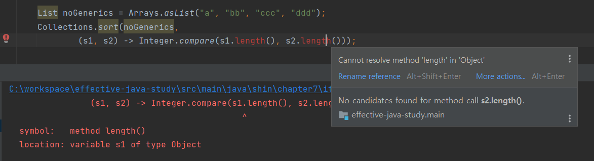
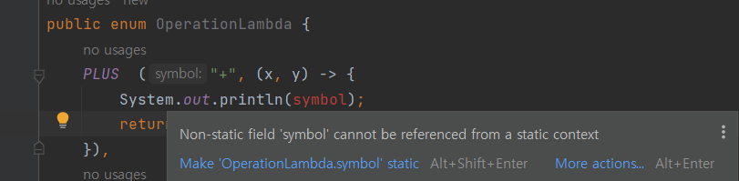

# Item42 - 익명 클래스보다는 람다를 사용하라

## 익명 클래스(Annonymous Class)

예전에는 함수 객체를 만드는 주요 수단으로 익명 클래스를 많이 사용했다.

**함수객체란 ?**

추상 메서드 하나만 담은 인터페이스(드물게는 추상 클래스)의 인스턴스

**정렬을 위한 비교함수로 익명클래스를 사용한 예시**

```java
// 익명 클래스를 함수 객체로 사용 - 낡은 기법!
Collections.sort(words, new Comparator<String>() {
    public int compare(String s1, String s2) {
        return Integer.compare(s1.length(), s2.length());
    }
});
```
이 방식은 낡은 기법이고, 코드가 너무 길어서 함수형 프로그래밍에 적합하지 않다.

## 람다(Lambda expression)

자바 8 이후, 추상 메서드가 하나인 인터페이스(**함수형 인터페이스**)들의 인스턴스를 **람다**로 만들 수 있게 되었다.

```java
@FunctionalInterface
public interface Comparator<T> {
    int compare(T o1, T o2);
}
```

앞선 익명 클래스 코드를 **람다**로 바꿔보자.

```java
// 람다식을 함수 객체로 사용 - 익명 클래스 대체
Collections.sort(words,
        (s1, s2) -> Integer.compare(s1.length(), s2.length()));
```

코드가 훨씬 간결하고, 어떤 동작을 하는지 명확히 드러난다.

특이한 점은 람다, 매개변수(s1, s2), 반환값의 타입은 각각 (Comparator<String>), String, int 지만 코드에서는 언급이 없다.
이는 컴파일러가 문맥을 살펴 타입을 추론하기 때문이다.

**타입을 명시해야 코드가 더 명확할 때를 제외하고는, 람다의 모든 매개변수 타입은 생략하도록 한다.**

**덧붙일 점**

타입 추론 시, 컴파일러는 필요한 타입 정보 대부분을 제네릭에서 얻는다.

제네릭 정보를 제공하지 않으면 컴파일러는 타입 정보를 추론할 수 없게 된다.

**Collections.sort**
- sort 시그니처를 보면 제네릭으로 타입이 결정되고 있다.
```java
public static <T> void sort(List<T> list, Comparator<? super T> c) {
      list.sort(c);
}
```

**리스트 선언 시, 제네릭 정보를 제공하지 않아서 컴파일 오류가 발생했다.**



- 제네릭 정보를 얻지 못한 컴파일러가 타입을 String이 아닌 Object로 판단했다.
- String의 length메서드를 의도하고 코드를 짰는데, Object로 추론된 타입 때문에 컴파일 오류 발생 


## 열거 타입에서의  람다

```java
// 추상 메서드 구현
public enum Operation {
    PLUS("+") {
        public double apply(double x, double y) { return x + y; }
    },
    MINUS("-") {
        public double apply(double x, double y) { return x - y; }
    },
    TIMES("*") {
        public double apply(double x, double y) { return x * y; }
    },
    DIVIDE("/") {
        public double apply(double x, double y) { return x / y; }
    };

    private final String symbol;

    Operation(String symbol) {
        this.symbol = symbol;
    }

    public abstract double apply(double x, double y);
}
```

추상 메서드를 선언하고, 상수별 클래스 몸체를 두어 각기 다른 연산을 구현한 코드이다.

이를 람다로 표현하면 훨씬 간결하고 깔끔하게 개선할 수 있다.

```java
// 람다 구현
public enum OperationLambda {
    PLUS("+", (x, y) -> x + y),
    MINUS("-", (x, y) -> x - y),
    TIMES("*", (x, y) -> x * y),
    DIVIDE("/", (x, y) -> x / y);

    private final String symbol;
    private final DoubleBinaryOperator op;

    OperationLambda(String symbol, DoubleBinaryOperator op) {
        this.symbol = symbol;
        this.op = op;
    }

    public double apply(double x, double y){
        return op.applyAsDouble(x,y);
    }
}
```

java.util.function 패키지의 DoubleBinaryOperator 인터페이스를 람다로 구현해서
enum의 인스턴스 필드로 두었다.

**몸통 클래스를 구현**한 것 보다 **짧고 보기 편한 코드**가 되었다.

### 열거 타입에서 람다 사용 시 주의사항

**1. 람다는 이름이 없기 때문에 문서화 할 수 없다.**

코드 자체로 동작이 명확히 설명되지 않거나 람다로 표현한 코드가 세 줄 이상이라면 람다를 사용하지 말자.

**2. 열거 타입 생성자 안의 람다는 열거 타입의 인스턴스 멤버에 접근할 수 없다.**


2번 추가 설명

람다를 생성자의 인수로 넘길 때, 인스턴스 멤버인 symbol을 참조하면 컴파일 오류가 발생한다.



- 인스턴스 멤버는 해당 열거 타입의 인스턴스가 생성된 이후 초기화 된다.
- 따라서 람다가 생성자의 인자로 전달되는 시점에 인스턴스 멤버인 symbol을 참조할 수 없다.

## 람다가 대체할 수 없는 것

1. **람다는 함수형 인터페이스에서만 쓰인다.**
- 함수형 인터페이스란 추상메서드 한 개인 인터페이스를 말한다.
- 사용 불가 케이스 → 익명 클래스를 써야한다.
    - 추상 메서드가 여러 개인 인터페이스의 인스턴스를 만들 경우
    - 추상 클래스의 인스턴스를 만들 경우

추상 클래스 인스턴스 생성방법을 코드로 살펴보자.
```java
// 추상 클래스
abstract class Animal {
    public abstract void makeSound();
}

// Animal 클래스를 상속받는 클래스
class Dog extends Animal {
    public void makeSound() {
        System.out.println("멍멍!");
    }
}

public class Main {
    public static void main(String[] args) {
        // Dog 클래스를 이용하여 객체를 생성하여 사용
        Animal animal = new Dog();
        animal.makeSound();

        // 익명 클래스를 이용하여 객체를 생성하여 사용
        Animal animal2 = new Animal() {
            public void makeSound() {
                System.out.println("야옹!");
            }
        };
        animal2.makeSound();
    }
}
```

2. **람다는 자기자신을 참조할 수 없다.**
- 람다에서의 this 키워드는 바깥 인스턴스를 가리킨다.
- 익명 클래스에서의 this는 익명 클래스의 인스턴스 자신을 가리킨다.
- 함수 객체가 자신을 참조해야 한다면 익명 클래스를 써야한다.
