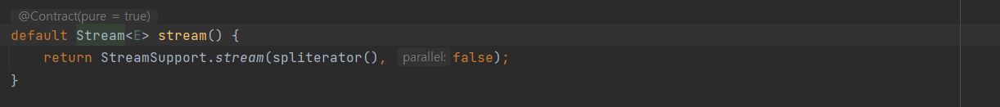

# Item45 - 스트림은 주의해서 사용하라

## 스트림 API

스트림은 **다량의 데이터 처리 작업**(순차/병렬)을 위해 자바 8에서 등장했다.

## 스트림 API 핵심 추상 개념

두 가지 핵심적인 추상 개념을 제공한다.

1. 스트림
    - 데이터 원소의 유한 또는 무한 시퀀스를 나타낸다.
2. 스트림 파이프라인
    - 스트림 원소들로 수행하는 연산단계를 표현하는 개념이다.

스트림의 원소는 어디로부터든 올 수 있으며,

대표적으로 컬렉션, 배열, 파일, 정규표현식 패턴 매처, 난수 생성기 등이 있다.

1. 컬렉션


2. 배열


3. 파일


4. 정규표현식 패턴 매처


5. 난수 생성기
- 무한 스트림


- 유한 스트림


6. 기본 스트림 - IntStream, LongStream, DoubleStream

## 스트림 파이프라인

스트림 파이프라인은 소스 스트림으로 시작해 종단 연산으로 끝나며,

그 사이에 중간연산이 들어갈 수 있다.

```java
public class Dummy {
    public static void main(String[] args) {
        List<String> nameList = Arrays.asList("a", "b", "c");

        nameList.stream() // 소스 스트림
                .filter(s -> s.startsWith("a")) // 중간 연산
                .forEach(System.out::println); // 종단 연산
    }
}
```

### 중간 연산

- 스트림 파이프라인에서 각 중간 연산은 스트림을 어떠한 방식으로 변환한다.
- 변환된 스트림의 원소 타입은 변환전과 같을 수도 있고, 다를 수도 있다.
- 각 원소에 함수를 적용하거나, 특정 조건을 걸어 필터링 할 수 있는 등의 방식으로 사용한다.

**📌** 중간 연산의 종류

| 연산명 | 기능 |
| --- | --- |
| map | 입력 T 타입 요소를 R 타입 요소로 변환 |
| filter | 조건을 충족하는 요소를 필터링 |
| flatMap | 중첩된 구조를 한 단계 평탄화하고 단일 원소로 변환한 스트림 생성 |
| peek | 스트림 내의 각각의 요소를 대상으로 특정 연산을 수행 |
| skip | 처음 n개의 요소를 제외하는 스트림 생성 |
| limit | maxSize까지의 요소만 제공하는 스트림 생성 |
| distinct | 스트림 내의 요소의 중복 제거 |
| sorted | 스트림 내 요소를 정렬 |

### 종단 연산

- 마지막 중간 연산이 내놓은 스트림에 최후 연산을 가한다.
- 원소를 정렬해 컬렉션에 담거나 모든 원소를 출력하는 등의 방식으로 사용할 수 있다.

**📌** 종단 연산의 종류

| 연산명 | 기능 |
|----|----|
| forEach | 스트림을 순회 |
| reduce | 연산을 이용해 모든 스트림 요소를 처리하여 하나의 결과로 만듦 |
| collect | 스트림의 연산 결과를 컬렉션 형태로 모아줌 |

### 지연 평가(Lazy evaluation)

스트림 파이프라인은 지연평가 되며, 평가는 종단 연산이 호출될 때 이뤄진다.

- 종단 연산에 쓰이지 않는 데이터 원소는 연산에 사용되지 않는다.
- 종단 연산이 없는 스트림 파이프라인은 아무 일도 하지 않는다.
- 무한 스트림을 다룰 수 있게 된다.

### 특징

- 파이프라인 여러개를 연결해 표현식 하나로 구현 가능하다.
- 기본적으로 스트림 파이프라인은 순차적으로 수행된다.
    - 병렬로 실행하고 싶은 경우 `parallel` 메서드를 호출하면 되지만, 효과를 볼 수 있는 상황은 많지 않다.

## 주의 사항

### 1. 과도한 스트림 사용은 피하라

책에 있는 아나그램 처리 예시입니다.

### 스트림을 사용하지 않은 버전의 아나그램 처리

```java
public class IterativeAnagrams {

    @Test
    void anagramTest() {
        List<String> words = new ArrayList<>();
        words.add("stop");
        words.add("spot");
        words.add("post");
        words.add("ball");
        words.add("cake");
        words.add("desk");

        Map<String, Set<String>> groups = new HashMap<>();

        // 그룹핑하기
        for (String word : words) {
            groups.computeIfAbsent(alphabetize(word), (unused) -> new TreeSet<>()).add(word);
        }

        // 필터링하기
        for (Set<String> group : groups.values()) {
            if(group.size() >= 2) {
                System.out.println(group.size() + ": " + group);
            }
        }
    }

    private String alphabetize(String s) {
        char[] a = s.toCharArray();
        Arrays.sort(a);
        return new String(a);
    }
}
```

- 단어를 알파벳으로 쪼갠 뒤 알파벳을 정렬하고, 정렬된 알파벳을 기준으로 그룹핑했다.
    - ex) `stop`  → [ ‘o’, ‘p’, ‘s’, ‘t’ ] :  `opst`
    - ex) `spot`  → [ ‘o’, ‘p’, ‘s’, ‘t’ ] :  `opst`
    - ex) `post`  → [ ‘o’, ‘p’, ‘s’, ‘t’ ] :  `opst`
    - 셋은 같은 그룹(`opst`)에 묶인다.
- 그룹 내 원소의 수가 2개 이상이라면 출력하도록 구현했다.

### 스트림을 사용한 버전 (과용)

```java
// 스트림을 과용하여 읽기 어려운 코드이다.
public class StreamAnagrams {

    @Test
    void anagramTest() {
        List<String> words = new ArrayList<>();
        words.add("stop");
        words.add("spot");
        words.add("post");
        words.add("ball");
        words.add("cake");
        words.add("desk");

        words.stream().collect(
                        Collectors.groupingBy(
                                word -> word.chars().sorted()
                                        .collect(StringBuilder::new,
                                                (sb, c) -> sb.append((char) c),
                                                StringBuilder::append).toString()))
                .values().stream()
                .filter(group -> group.size() >= 2)
                .map(group -> group.size() + ": " + group)
                .forEach(System.out::println);
    }
}

```
- 함수 사용 없이 내부에서 처리해서, 단 하나의 표현식으로 구현했다.
- 적절하게 코드의 캡슐화가 이뤄지지 않아 스트림을 사용하지 않았을 때보다 코드 읽기가 힘들어졌다.

### 스트림을 사용한 버전 (적절)

위의 코드를 적절한 스트림 사용으로 개선할 수 있다.

```java
public class HybridAnagrams {

    @Test
    void anagramTest() {
        List<String> words = new ArrayList<>();
        words.add("stop");
        words.add("spot");
        words.add("post");
        words.add("ball");
        words.add("cake");
        words.add("desk");

        words.stream().collect(
                        Collectors.groupingBy(word -> alphabetize(word)))
                .values()
                .stream()
                .filter(group -> group.size() >= 2)
                .map(group -> group.size() + ": " + group)
                .forEach(System.out::println);
    }

    private String alphabetize(String s) {
        char[] a = s.toCharArray();
        Arrays.sort(a);
        return new String(a);
    }
}

```

- `alphabetize()` 메서드로 적절한 캡슐화를 진행했다.
- 메서드 체이닝 형식이 보기 깔끔하다.
    - 스트림을 사용하지 않은 버전보다 결과가 연계된다는 것이 확실히 잘 느껴진다.

**💡 이처럼 무조건 스트림을 사용하기보다는 절충 지점을 잘 찾아 사용하는 것이 중요하다.**

### **2. `char` 값들을 처리할 때는 스트림 사용을 삼가는 편이 낫다.**

**char 값을 스트림으로 처리하는 코드**
```java
"hellow World".chars().forEach(System.out::println); // 72101108108111321191111141081003
```

`char`를 스트림 요소로 사용하면 `char`가 아닌 `int`값이 반환된다.

```java
"hellow World".chars().forEach(x -> System.out.println((char) x);
```

위 코드처럼 형변환을 명시적으로 하여 원하는 값을 얻을 수 있지만,
 
**char 값들을 처리할 때는 스트림을 삼가하는 편이 낫다.**

### 3. 리팩터링
**기존 코드(반복문)는 스트림을 사용하도록 리팩터링 하되, 새 코드가 더 나아 보일 때만 반영하자.**

스트림과 반복문을 적절히 조합해서 사용하는 것이 최선이 될 수 있다.

---
## 스트림 사용이 적절하지 않은 경우

스트림 파이프라인은 연산을 함수 객체(주로 람다나 메서드 참조)로 표현한다.

함수 객체로는 할 수 없지만 코드 블록으로는 할 수 있는 일들이 있다.

- 지역 변수 수정
    - 함수 객체에서는 final 혹은 effectively final인 변수만 읽을 수 있고, 지역 변수를 수정하는게 불가능하다.
- return, break, continue를 수행하거나 메서드 예외 던지기
    - 함수 객체에서는 위의 나열된 로직 중 어떠한 것도 수행할 수 없다.

연산 로직에서 이상의 일들을 수행해야 한다면 스트림과 맞지 않는다.

## 스트림을 사용하면 좋은 경우

- 원소들의 시퀀스를 일관되게 변환한다.
- 원소들의 시퀀스를 필터링한다.
- 원소들의 시퀀스를 연산 후 결합한다.(더하기, 연결, 최솟값 구하기)
- 원소들의 시퀀스를 컬렉션에 모은다.
- 원소들의 시퀀스 중 특정 조건을 만족하는 원소를 찾는다.

위 5가지 케이스 중 하나를 수행하는 로직이라면 스트림을 적용하기 좋은 후보이다.

## 스트림으로 처리하기 어려운 경우

### 1. 파이프 라인이 여러 단계(stage)를 통과할 때, 이 데이터의 각 단계에서의 값들에 동시에 접근하기 어렵다.

```java
public class MersennePrimes {
    static Stream<BigInteger> primes() {
        return Stream.iterate(TWO, BigInteger::nextProbablePrime);
    }

    public static void main(String[] args) {
        primes().map(p -> TWO.pow(p.intValueExact()).subtract(ONE))
                .filter(mersenne -> mersenne.isProbablePrime(50))
                .limit(20)
                .forEach(mp -> System.out.println(mp.bitLength() + ": " + mp));
    }
}
```
output (p : 2^p - 1)

**결과 출력 시, 각 메르센 소수 앞에 지수 p를 출력하길 원한다.**

```bash
2: 3
3: 7
5: 31
7: 127
13: 8191
17: 131071
19: 524287
31: 2147483647
...
```
- 지수(p) 값은 초기 스트림에만 나타나므로 결과를 출력하는 종단연산에서는 접근할 수 없다.
- 첫번째 중간 연산에서 수행한 매핑을 거꾸로 수행해서 메르센 수의 지수(p)를 출력했다.
- 스트림 파이프라인은 일단 한 값을 다른 값에 매핑하고 나면 원래 값을 잃는다.
- 기존 값이 필요한 경우 해당 예시처럼 매핑해서 우회할 수는 있지만 원래 목적을 잃게 된다.

### 2. 스트림과 반복 중 어느 쪽을 써야 할지 바로 알기 어려운 작업

```java
// 1. 반복문을 사용한 구현
private static List<Card> newDeck() {
    List<Card> result = new ArrayList<>();
    for (Suit suit : Suit.values())
        for (Rank rank : Rank.values())
            result.add(new Card(suit, rank));
    return result;
}
```

```java
// 2. 스트림을 이용한 구현
private static List<Card> newDeck() {
    return Stream.of(Suit.values())
            .flatMap(suit ->
                    Stream.of(Rank.values())
                            .map(rank -> new Card(suit, rank)))
            .collect(toList());
}
```

- 개인 취향 문제에 해당하므로, 사용하고 싶은 것을 사용해도 좋다.
- 만약, 협업 하는 사람들이 선호하는 방식이 있다면, 그것을 선택하는 것이 더 좋다.

## 핵심 정리

- 스트림을 사용해야 멋지게 처리할 수 있는 일이 있고, 반복 방식이 더 알맞은 일도 있다.
- 수많은 작업이 이 둘을 조합했을 때 가장 멋지게 해결된다.
- **스트림과 반복 중 어느 쪽이 더 나은지 확신하기 어렵다면 둘 다 해보고 더 나은쪽을 선택하자.**
