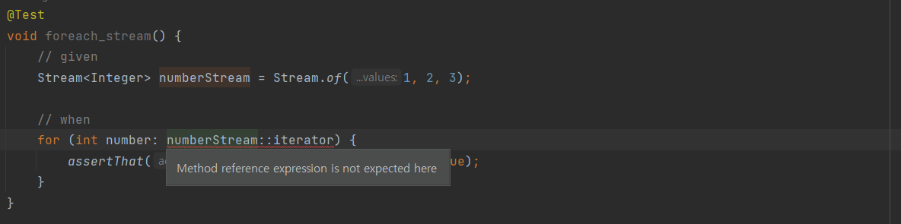

# Item 47 - 반환 타입으로는 스트림보다 컬렉션이 낫다.

## **서론**

- 자바 7까지는 일련의 원소를 반환하는 메서드의 반환 타입으로 `컬렉션 인터페이스` , `Iterable`,  `배열`을 써왔다.
    - 기본은 컬렉션 인터페이스를 사용한다.
    - Iterable 인터페이스
        - for-each 문에서만 쓰일 경우
        - 반환된 원소 시퀀스가 일부 Collection 메서드를 구현할 수 없을 경우
    - 배열
        - 반환된 원소들이 기본 타입일 경우
        - 성능에 민감한 상황일 경우
- 자바 8의 스트림 도입 후 이 선택이 복잡해졌다.

## **Iterable vs Stream**

스트림은 반복을 지원하지 않는다.

```java
List<Integer> numbers = Arrays.asList(1, 2, 3);
  
for (int number : numbers.stream()) {
    // ...
}
```

위 코드에서 for-each 문에 들어간 `numbers.stream()` 은 컴파일 에러가 난다.

for-each 문은 `List`, `Set`과 같은 `Iterable` 인터페이스 구현체에서 사용가능하다.
```java
@Test
void foreach_iterable() {
    List<Integer> numbers = Arrays.asList(1, 2, 3);
    
    for (int number: numbers) {
        assertThat(number <= 3).isEqualTo(true);
    }
}
```
위 코드는 아무 문제 없이 동작한다. 이런 차이로 만약 반복문 사용을 원하는 사용자에게 `Stream`을 반환하는 API를 제공한다면 불만을 토로할 것이다.

**만약 이런 불만을 잠재우기 위해서 `Stream`을 `Iterable`로 변환하도록 지원하면 될까❓**

## **Stream → Iterable로 변환하기**

사실 `Stream`인터페이스는 `Iterable`인터페이스가 정의한 메서드를 전부 포함한다.

뿐만 아니라 `Iterable` 인터페이스가 정의한 방식대로 동작한다.

```java
public interface Iterable<T> {

    Iterator<T> iterator();

    default void forEach(Consumer<? super T> action) {
        Objects.requireNonNull(action);
        for (T t : this) {
            action.accept(t);
        }
    }

    default Spliterator<T> spliterator() {
        return Spliterators.spliteratorUnknownSize(iterator(), 0);
    }
}
```

```java
public interface BaseStream<T, S extends BaseStream<T, S>>
        extends AutoCloseable {

    Iterator<T> iterator();

    Spliterator<T> spliterator();

    // ...
}

public interface Stream<T> extends BaseStream<T, Stream<T>> {

    // ...

    void forEach(Consumer<? super T> action);

    // ...
}
```

- `Iterable`에 존재하는 `iterator`, `forEach`, `spliterator`를 `Stream`에서도 지원한다.
- 하지만 for-each로 `Stream`을 반복할 수 없는 이유는 `Iterable`을 확장(extends)하지 않아서다.

### **스트림을 반복하기 위한 우회**

Stream의 iterator 메서드에 메서드 참조를 넘긴다면 해결될까❓

```java
@Test
void foreach_stream() {
    Stream<Integer> numberStream = Stream.of(1, 2, 3);

    for (int number: numberStream::iterator) {
        assertThat(number <= 3).isEqualTo(true)
    }
}
```



- 컴파일러가 타입 추론을 적절히 하지 못해서 컴파일 오류난다.

이를 해결하려면 `Iterable`로 명시적 형변환이 필요하다.

```java
@Test
void foreach_stream() {
    Stream<Integer> numberStream = Stream.of(1, 2, 3);
    
    for (int number: (Iterable<Integer>) numberStream::iterator) {
        assertThat(number <= 3).isEqualTo(true);
    }
}
```

- `Iterable`로 형변환한 코드
- 작동은 하지만 난잡하고, 직관성이 떨어진다.
<details>
<summary>📌 참고) stream::iterator 가 Iterable 이 되는 이유</summary>
<div markdown="1">
  Iterable 인터페이스는 추상 메서드가 `iterator`하나이므로 함수형 인터페이스로 볼 수 있다.

    ```java
    public interface Iterable<T> {
        Iterator<T> iterator();
    
        default void forEach(Consumer<? super T> action) {
            Objects.requireNonNull(action);
            for (T t : this) {
                action.accept(t);
            }
        }
    
        default Spliterator<T> spliterator() {
            return Spliterators.spliteratorUnknownSize(iterator(), 0);
        }
    }
    
    ```

  따라서 Iterable 인터페이스는 `iterator` 구현을 람다로 제공할 수 있다.

    ```java
    @Test
    void foreach_stream() {
        // given
        Stream<Integer> numberStream = Stream.of(1, 2, 3);
    
        // when
        for (int number: (Iterable<Integer>) () -> numberStream.iterator()) {
            assertThat(number <= 3).isEqualTo(true);
        }
    }
    ```

  따라서 앞선 예시인 `Iterable`로 형변환한 메서드 참조 코드를 위와 같이 람다로 변환할 수 있다.

  즉, 람다가 `Iterable.iterator`를 구현한 것이 되므로 메서드 참조로 변환 가능하다.
</div>
</details>

이를 보완하기 위해 **어댑터 메서드**를 제공할 수 있다.

## **🔑 Stream → Iterable 어댑터**

```java
@Test
void foreach_stream() {
    Stream<Integer> numberStream = Stream.of(1, 2, 3);
    for (int number: iterableOf(numberStream)) {
        assertThat(number <= 3).isEqualTo(true);
    }
}

// Stream -> Iterable 로 중개해주는 어댑터
private static <E> Iterable<E> iterableOf(Stream<T> stream) {
    return stream::iterator;
}
```
이렇게 하면 어떤 스트림도 for-each 문으로 반복할 수 있다.

자바의 타입 추론이 문맥을 잘 파악하여 어댑터 메서드 안에서 따로 형변환 하지 않아도 된다.

### **🔑 Iterable → Stream 어댑터**

```java
private static <E> Stream<E> streamOf(Iterable<E> iterable) {
    return StreamSupport.stream(iterable.spliterator(), false);
}

@Test
void foreach_stream_adaptor() {
    // given
    List<Integer> numbers = Arrays.asList(1, 2, 3);

    // when
    Stream<Integer> numberStream = streamOf(numbers);

    // then
    numberStream.forEach(number -> assertThat(number <= 3).isTrue());
}
```
마찬가지로 `Iterable`만 반환하는 API를 `Stream`으로 사용하기 위한 어댑터를 만들 수도 있다.

Java 표준 라이브러리에서 제공하는 `StreamSupport.stream` 를 활용했다.

- 메서드가 오직 스트림 파이프라인에서만 쓰일 걸 안다면 Stream을 반환해라
- 반대로 반복문에서만 쓰일 걸 안다면 Iterable을 반환하라.
- 하지만 공개 API를 작성할 때는 명확한 근거가 없다.
- 양쪽 모두를 배려해야 한다.
## **Collection  인터페이스**

`Collection`인터페이스는`Iterable` 인터페이스의 하위 타입이고, `stream` 메서드도 제공한다.

즉, 반복과 스트림을 동시 지원한다.

```java
public interface Collection<E> extends Iterable<E> {
    // ...

    default Stream<E> stream() {
        return StreamSupport.stream(spliterator(), false);
    }

    // ...
}
```

**💡 따라서 원소 시퀀스를 반환하는 공개 API의 반환 타입에는 Collection이나 그 하위 타입을 쓰는 게 일반적으로 최선이다.**

## **반환하는 컬렉션이 너무 크다면 전용 컬렉션도 고려하라**

하지만 단지 컬렉션을 반환한다는 이유로 덩치 큰 시퀀스를 메모리에 올려서는 안된다.

**책에서 나온 멱집합 반환 예시를 살펴보자.**

- 주어진 집합의 멱집합(한 집합의 모든 부분집합을 원소로 하는 집합)을 반환하는 경우
    - {a, b, c}의 멱집합은 {{}, {a}, {b}, {c}, {a, b}, {b, c}, {a, c}, {a, b, c}}
    - 원소 개수가 n개 → 멱집합 원소 개수 2^n개

표준 컬렉션은 위험하나, `AbstractList`를 이용하면 전용 `Collection` 구현 가능

**✅ 해결책**

```java
public class PowerSet {
  public static final <E> Collection<Set<E>> of(Set<E> s) {
    List<E> src = new ArrayList<>(s);
    if(src.size() > 30) {
      // int size이므로 최대길이 제한이 있음(컬렉션 반환 타입 단점)
      throw new IllegalArgumentException("집합에 원소가 너무 많습니다(최대 30개): " + s);
    }

    return new AbastractList<Set<E>>() {
      @Override public int size() {
	      // 멱집합의 크기는 2를 원래 집합의 원소 수만큼 거듭제곱 것과 같다.
        return 1 << src.size();
      }

      @Override public boolean contains(Object o){
        return o instanceof Set && src.containsAll((Set)o);
      }

      @Override public Set<E> get(int index){
        Set<E> result = new HashSet<>();
        for(int i = 0; index !=0; i++, index >>= 1){
          if((index & 1) == 1){
            result.add(src.get(i));
          }
        }
        return result;
      }
    }
  }
}
```

참고로 `AbstractCollection`을 활용하여 `Collection` 구현체를 작성할 때는 아래 3개의 메서드는 반드시 구현해야한다.

- `Iterable`용 메서드
- `contains`
- `size`

만약 `contains`와 `size`를 구현하는게 불가능한 경우 `Stream`이나 `Iterable`을 반환하는 편이 좋다.
이렇게 전용 컬렉션을 구현하는 것이 스트림보다 약 1.4배 정도 더 빨랐으며,
어댑터 형식은 스트림보다 약 2.3배 더 느리다고 한다.(이펙티브 자바 저자의 컴퓨터 기준)

---

## **정리**

1. `Iterable`과 `Stream`은 어댑터 메서드를 통해서 서로 변환이 가능하다.
2. 어댑터 메서드는 클라이언트 메서드를 어수선하게 만들며 성능 또한 좋지 못하다.
3. 만약 반환값이 `Stream`만 쓴다고 보장된다면 `Stream`을 반환해도 무방하다.

   반대로 `Iterable`의 경우도 마찬가지이다.

4. 사용자를 생각하여 반환 값은 가능하면 `Iterable`의 하위 타입이면서 `stream`을 지원하는 `Collection`의 하위 타입을 반환하자.
