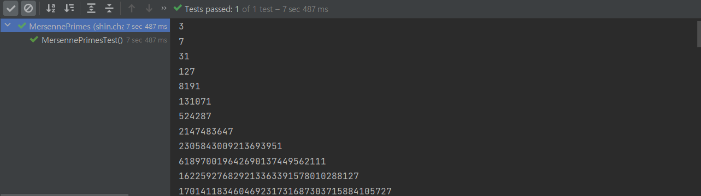
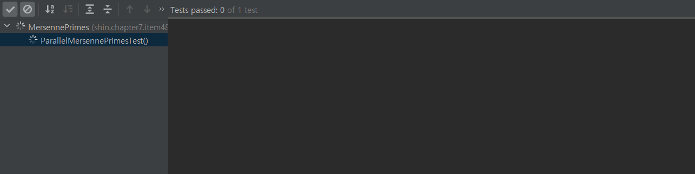
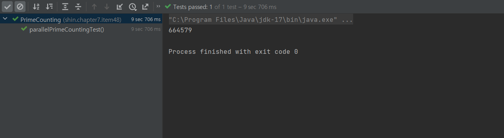

# Item 48 - 스트림 병렬화는 주의해서 적용하라

## **자바와 동시성 프로그래밍**

동시성 프로그래밍 측면에서 자바는 항상 앞서갔다.

- 스레드, 동기화, wait/notify - *처음 릴리즈부터 지원*
- 동시성 컬렉션(`java.util.concurrent`), 실행자 프레임워크(`Executor`) - *자바 5부터 지원*
- 고성능 병렬 분해 프레임워크(`parallel decom-position`), 포크-조인 패키지 - *자바 7부터 지원*
- 병렬 스트림 메서드(`parallel`) - *자바 8부터 지원*

동시성 프로그램을 작성하기는 쉬워지고 있지만, 올바르고 빠르게 작성하는 일은 여전히 어렵다.

동시성 프로그래밍을 할 때는 항상 **안정성(safety)**과 **응답 가능(liveness) 상태**를 유지해야 한다.

병렬 스트림 파이프라인 프로그래밍에서도 마찬가지다.

## **파이프라인 병렬화로 성능 개선을 기대하기 어려운 경우**

스트림을 사용해 처음 20개의 메르센 소수를 생성하는 프로그램

```java
public class MersennePrimes {

    @Test
    void MersennePrimesTest() {
        primes().map(p -> TWO.pow(p.intValueExact()).subtract(ONE))
                .filter(mersenne -> mersenne.isProbablePrime(50))
                .limit(20)
                .forEach(System.out::println);
    }

    static Stream<BigInteger> primes() {
        return Stream.iterate(TWO, BigInteger::nextProbablePrime);
    }
}
```


- 프로그램 수행 시, 약 7.5초 걸렸다.

속도를 높이고 싶어 `parallel` 을 호출해 병렬 처리를 한다고 해보자.

이 프로그램의 성능은 어떻게 변할까?

```java
public class MersennePrimes {

    @Test
    void ParallelMersennePrimesTest() {
        primes().map(p -> TWO.pow(p.intValueExact()).subtract(ONE))
                .parallel() // 스트림 병렬화
                .filter(mersenne -> mersenne.isProbablePrime(50))
                .limit(20)
                .forEach(System.out::println);
    }

    static Stream<BigInteger> primes() {
        return Stream.iterate(TWO, BigInteger::nextProbablePrime);
    }
}
```


- 아무 것도 출력하지 못하고, 응답 불가 상태가 된다.
- 스트림 라이브러리가 파이프라인을 병렬화하는 방법을 찾아내지 못했기 때문이다.
- **데이터 소스가 Stream.iterate거나 중간 연산으로 limit를 쓰면 파이프라인 병렬화로는 성능 개선을 기대할 수 없다.**

즉, 스트림 파이프라인을 마구잡이로 병렬화하면 오히려 성능이 나빠질 수 있다.

## **스트림 병렬화는 어떤 경우 사용해야 할까❓**

### **✔️ 병렬화 효과가 좋은 스트림 소스**

- `ArrayList`, `HashMap`, `HashSet`, `ConcurrentHashMap`의 인스턴스, 배열, int 범위, long 범위

### **✔️ 병렬화 효과가 좋은 자료구조의 공통점**

1. 정확하고 쉽게 나눌 수 있다.
   1. **데이터를 원하는 크기로 정확하고 쉽게 나눌수 있다.**
   2. 따라서 다수의 스레드에 분배하기 좋다.
   3. 나누는 작업은 **Spliterator**가 담당하며, Stream이나 Iterable의 spliterator 메서드로 얻는다.
2. 참조 지역성이 뛰어나다.
   1. 이웃한 원소의 참조들이 메모리에 연속해서 저장되어 있다.
   2. 다량의 데이터를 처리하는 벌크 연산을 병렬화 할 때 유리하다.
   > 참조 지역성이 가장 뛰어난 자료구조는 기본 타입 배열이다. 기본 타입 배열은 데이터 자체가 메모리에 연속적으로 저장되기 때문이다.

## **종단 연산과 병렬화**

스트림 파이프라인의 종단 연산의 동작 방식 역시 병렬 수행 효율에 영향을 준다.

### **병렬화에 적합한 종단 연산 ⭕**

- 축소 종단 연산(파이프라인에서 만들어진 모든 원소를 하나로 합치는 작업)
- Stream의 `reduce` 메서드 중 하나, 혹은 `min`, `max`, `count`, `sum`
- `anyMatch`, `allMatch`, `noneMatch` - 조건에 맞으면 바로 반환되는 메서드

### **병렬화에 적합하지 않은 종단 연산 ❌**

- 가변 축소(mutable reduction)를 수행하는 Stream의 `collect` 메서드는 병렬화에 적합하지 않다.
- 컬렉션을 합치는 부담이 크기 때문이다.

## **🔑 병렬화 올바르게 사용하기**

### **안전 실패(safety failure)**

- 안전 실패란, 스트림을 잘못 병렬화 했을 때 성능이 나빠질 뿐 아니라, 결과 자체가 잘못되거나 예상치 못한 동작이 발생하는 것을 말한다.
- 병렬화한 파이프라인이 사용하는 `mappers`, `filters`, 혹은 프로그래머가 제공한 다른 함수 객체가 명세대로 동작하지 않을 때 벌어질 수 있다.
- Stream 명세는 함수 객체에 관한 엄중한 규약을 정의해놨다.

### **✔️ Stream 명세 규약**

- Stream의 reduce 연산에 건네지는 누적기와 결합기 함수는 반드시 **결합 법칙**을 만족해야 한다.

  결합 법칙 : (a op b) op c == a op (b op c)

- 간섭받지 않아야 한다. (non-intefering)

  **파이프라인이 수행되는 동안 데이터 소스가 변경되지 않아야 한다.**

- 상태를 갖지 않아야 한다. (stateless)

이러한 요구사항을 지키지 못하는 상태에서 병렬로 파이프라인을 수행하면 실패로 이어지기 쉽다.

### 병렬화를 사용할 가치가 있는지 판단하자

- 스트림 병렬화는 오직 성능 최적화 수단임을 기억하자.
- 변경 전후로 반드시 성능을 테스트해서 병렬화를 사용할 가치가 있는지 판단해야한다.

## **병렬화를 효과적으로 사용한 예제**

조건이 잘 갖춰지면 `parallel` 메서드 호출 하나로 굉장한 성능 향상을 기대할 수 있다.

아래 예제는 병렬화 하기 좋은 조건을 갖춘 소수 계산 스트림 파이프라인 코드이다.

n보다 작거나 같은 소수의 개수를 계산하는 함수

```java
public class PrimeCounting {

    // 소수 계산 스트림 파이프라인
    static long pi(long n) {
        return LongStream.rangeClosed(2, n)
                .mapToObj(BigInteger::valueOf)
                .filter(i -> i.isProbablePrime(50))
                .count();
    }

    @Test
    void primeCountingTest() {
        System.out.println(pi(10_000_000));
    }
}
```


- 10^7 계산 시, 30초가 걸렸다.

`parallel` 메서드를 추가해서 병렬화 해보자

```java
public class PrimeCounting {

    // 병렬화 버전
    static long parallelPi(long n) {
        return LongStream.rangeClosed(2, n)
                .parallel()
                .mapToObj(BigInteger::valueOf)
                .filter(i -> i.isProbablePrime(50))
                .count();
    }

    @Test
    void parallelPrimeCountingTest() {
        System.out.println(parallelPi(10_000_000));
    }

}
```


- 10^7 계산 시, 9.7초가 걸렸다.
- `parallel` 호출을 추가한 것뿐이지만, **시간이 2배 이상 단축**됐다.

## **무작위 수들로 이루어진 스트림 병렬화**

- **`SplittableRandom` 인스턴스를 활용해서 병렬화하자.** 성능이 선형으로 좋아진다.
- Random을 사용하는 경우 병렬화를 해선 안된다.

  모든 연산을 동기화하기 때문에 최악의 성능으로 이어진다.

- 무작위 수 병렬화 연산 속도 (`SplittableRandom` > `ThreadLocalRandom` > `Random`)


## 💡 **정리**

- 계산도 정확하고 성능도 좋아질 거라는 확신 없이는 스트림 파이프라인 병렬화를 하지 말자.
- 수정 후 코드가 여전히 정확한지 확인하고 병렬화 사용 가치가 있는지 확인하자.
- 위의 조건들이 확실해졌을 때, 병렬화 버전 코드를 운영 코드에 반영하자.

## **🕶️ 참고**

https://www.baeldung.com/java-fork-join
