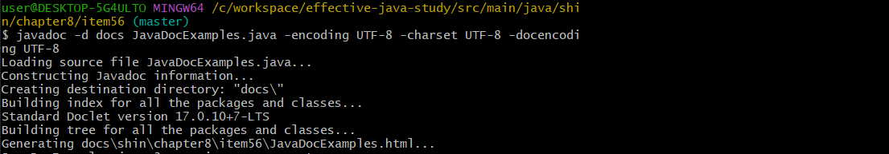
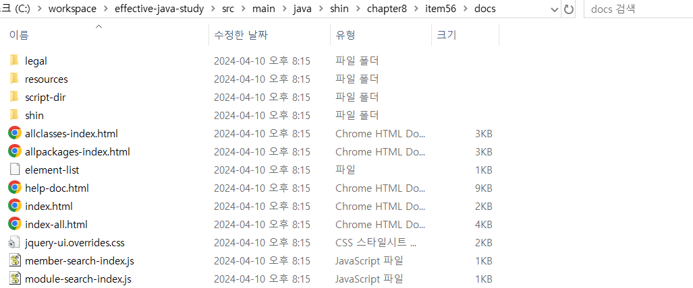
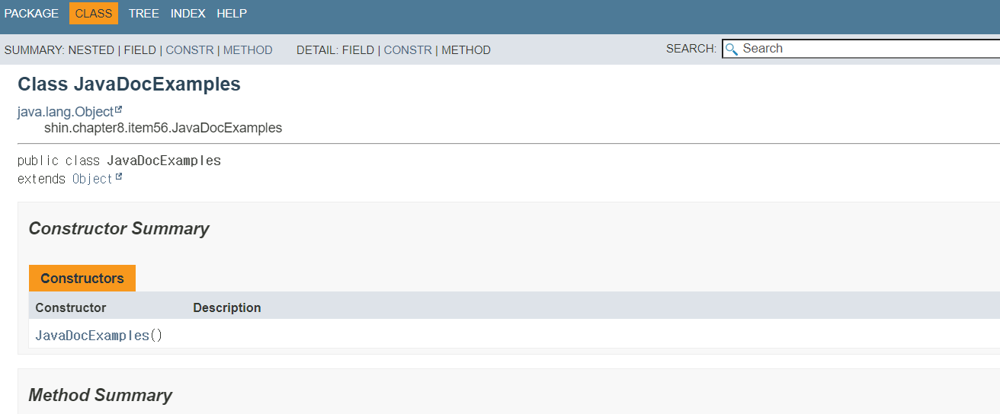
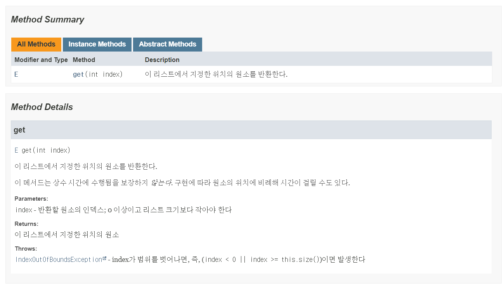
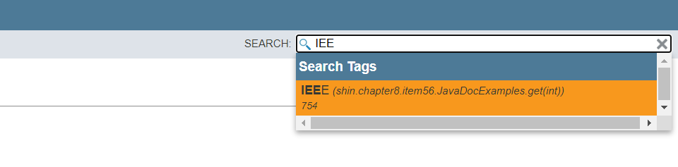

# Item 56 - 공개된 API 요소에는 항상 문서화 주석을 작성하라

## **자바독 (Javadoc) 이란?**

- API 문서화 유틸리티
- 자바독은 소스코드 파일에서 문서화 주석(자바독 주석)이라는 특수한 형태로 기술된 설명을 추려 API 문서로 변환해준다.

## **Javadoc 사용법**

**javadoc 명령어 사용**

```java
$ javadoc -d docs {file_name}.java
```

**한글 사용시 UTF-8로 인코딩 필요**

```java
$ javadoc -d docs {file_name}.java -encoding UTF-8 -charset UTF-8 -docencoding UTF-8
```

**javadoc 명령어 실행**


**javadoc이 자동으로 웹페이지 생성 - docs 디렉토리**


**생성된 api문서 - index.html**


## **Javadoc 주석 유의 사항**
[**문서화 주석 작성법(How To Write Doc Comments)**](https://www.oracle.com/technical-resources/articles/java/javadoc-tool.html) 웹페이지를 참고하자.

### **API를 올바르게 문서화하는 방법**

- 공개된 모든 클래스, 인터페이스, 메서드, 필드 선언에 문서화 주석을 달아야 한다.
- 직렬화할 수 있는 클래스라면 직렬화 형태에 대해서도 적어야 한다.
- 기본 생성자에는 문서화 주석을 달 수 없으니 공개 클래스는 절대 기본 생성자를 사용하지 말자.
- 유지보수까지 고려한다면 public 하지 않은 클래스, 인터페이스, 생성자, 메서드, 필드까지 문서화 주석을 달자. (공개 API만큼 친절하게 설명하진 않더라도)

### **메서드용 문서화 주석**

- **해당 메서드**와 **클라이언트 사이의 규약**을 명료하게 기술해야 한다.
- how가 아닌 **what**을 기술하자. (상속용으로 설계된 API가 아닌 이상)
- 메서드를 성공적으로 호출하기 위한 **전제조건**을 나열하자.
- 메서드가 성공적으로 수행된 후에 만족해야 하는 **사후조건**을 나열하자.
- **부작용**도 문서화 하자.

### **메서드 규약을 완벽하게 기술하려면 다음의 태그를 전부 활용해보자.**

- 모든 매개변수에 `@param` 태그
- 반환타입이 void가 아니면 `@return` 태그
- 발생할 가능성이 있는 모든 예외에 `@throws` 태그
- `@throws` 태그의 설명은 **if로 시작해 해당 예외를 던지는 조건을 설명하는 절**이 뒤따른다.
- 관례상 `@param`, `@return`, `@throws` 태그의 설명에는 **마침표를 붙이지 않는다**.
- 아래는 이상의 규칙을 모두 반영한 문서화 주석의 예시다.

```java
/**
 * 이 리스트에서 지정한 위치의 원소를 반환한다.
 *
 * <p>이 메서드는 상수 시간에 수행됨을 보장하지 <i>않는다</i>. 구현에 따라 원소의 위치에 비례해 시간이 걸릴 수도 있다.</p>
 *
 * @param index 반환할 원소의 인덱스; 0 이상이고 리스트 크기보다 작아야 한다
 * @return 이 리스트에서 지정한 위치의 원소
 * @throws IndexOutOfBoundsException index가 범위를 벗어나면, 
 *         즉, ({@code index < 0 || index >= this.size()})이면 발생한다
 */
E get(int index);
```
- 문서화 주석에 HTML 태그<p>와 <i>를 쓴 점에 주목하자.
- 자바독 유틸리티는 문서화 주석을 HTML로 변환하므로 문서화 주석 안의 HTML 요소들이 최종 HTML 문서에 반영된다.

**생성된 api 문서**

- `<p>` : 하나의 문단을 만듦, `<i>` :기울임 꼴

## **Javadoc 주석 태그**

### **`{@code}`**

- 태그로 감싼 내용을 **코드용 폰트**로 렌더링한다.
- 태그로 감싼 내용에 포함된 HTML 요소나 다른 자바독 태그를 무시한다.
- 주석에 여러 줄로 된 코드 예시를 넣으려면 `{@code}`를 `<pre>`태그로 감싸자. `<pre>{@code ...코드... }</pre>`

### **`{@literal}`**

- 태그로 감싼 내용에 포함된 HTML 요소나 다른 자바독 태그를 무시한다.
- `{@code}`와 비슷하지만 코드 폰트로 렌더링하지 않는다.
- 아래는 < 기호를 주석에 포함 시키기 위해 `@literal` 태그를 사용한 예시다.

```java
/**
 * A geometric series converges if {@literal |r| < 1}.
 */
```

### **`@implSpec`**

- **해당 메서드**와 **하위 클래스 사이의 계약**을 설명한다.
- 하위 클래스들이 그 메서드를 상속하거나 super 키워드를 이용해 호출할 때, 그 메서드가 어떻게 동작하는지 명확히 인지할 수 있도록 도와준다.

### **`{@inheritDoc}`**

- 상위 타입의 문서화 주석 일부를 상속할 수 있다.

### `{@index}`

- 자바9부터 자바독이 생성한 HTML 문서에 검색 기능이 추가됐다.
- {@index} 태그를 사용하면 자바독이 생성한 HTML에서 {@index}에 색인했던 이름으로 검색이 가능하다.

```java
/**
 * This method compiles with the {@index IEEE 754} standard
 */
```


### **제네릭, 열거 타입, 애너테이션 문서화 주석**

- **제네릭 타입, 제네릭 메서드**를 문서화할 때, 모든 타입 매개변수에 주석을 달아야 한다.

```java
/**
 * 키와 값을 매핑하는 객체, 맵은 키를 중복해서 가질 수 없다
 * 즉, 키 하나가 가리킬 수 있는 값은 최대 1개다.
 * 
 * @param <K> 이 맵이 관리하는 키의 타입
 * @param <V> 매핑된 값의 타입
 */
public interface Map<K, V> { ... }
```
- **열거 타입**을 문서화할 때, 상수들에도 주석을 달아야 한다.

```java
/**
 * 심포니 오케스트라의 악기 세션
 */
public enum OrchestraSection {
    /** 플루트, 클라리넷, 오보 같은 목관악기. */
    WOODWIND,
  
    /** 프렌치 호른, 트럼펫 같은 금관악기 */
    BRASS,
  
    /** 탐파니, 심벌즈 같은 타악기 */
    PERCUSSION,
  
    /** 바이올린, 첼로 같은 현악기 */
    STRING
}
```
- **애너테이션 타입**을 문서화할 때, 멤버들에도 모두 주석을 달아야 한다.
- 필드 설명은 명사구로 한다.

```java
/**
 * 이 주석이 달린 메서드는 명시한 예외를 던져야만 성공하는
 * 테스트 메서드임을 나타낸다.
 */

import java.lang.annotation.ElementType;
import java.lang.annotation.Retention;
import java.lang.annotation.RetentionPolicy;
import java.lang.annotation.Target;

@Retention(RetentionPolicy.RUNTIME)
@Target(ElementType.METHOD)
public @interface ExceptionTest {
    /**
     * 이 주석을 단 테스트 메서드가 성공하려면 던져야 하는 예외
     * (이 클래스의 하위 타입 예외는 모두 허용된다.)
     */
    Class<? extends Throwable> value();
}
```

## **API 문서화에서 자주 누락되는 설명**

**스레드 안정성**

- 클래스 혹은 정적 메서드가 스레드 안전하든 그렇지 않든, 스레드 안전 수준을 반드시 명시하자.

**직렬화 가능성**

- 직렬화할 수 있는 클래스라면 직렬화 형태도 API 설명에 기술해야 한다.

## **💡 핵심 정리**

- 문서화 주석은 여러분 API를 문서화하는 가장 훌륭하고 효과적인 방법이다.
- 공개 API라면 빠짐없이 설명을 달아야 한다.
- 표준 규약을 일관되게 지키자.
- 문서화 주석에 임의의 HTML 태그를 사용할 수 있음을 기억하라.

  단, HTML 메타문자는 특별하게 취급해야 한다.
