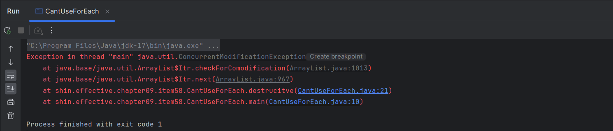

# Item 58 - 전통적인  for 문보다는 for-each 문을 사용하라

## **for-each 문을 사용해야 하는 이유**

### **전통적인 for 문의 아쉬운 점 🤔**

```java
List<String> fruits = List.of("Apple", "Orange", "Melon", "Lemon", "Banana");
int[] numbers = {1, 2, 3, 4, 5};

// Collection 순회
for (Iterator<String> i = fruits.iterator(); i.hasNext()) {
    String fruit = i.next();
    // ... fruit로 뭔가를 한다.
}

// 배열 순회
for (int i = 0; i < numbers.length; i++) {
    // ... numbers[i]로 뭔가를 한다.
}
```

- Iterator와 인덱스 변수는 코드를 지저분하게 할 뿐 이며, 실제로 필요한 것은 **원소**이다.
- 쓰이는 요소의 종류가 많아서 오류가 생길 가능성이 높다.
- 잘못된 변수를 사용했을 때 컴파일러가 잡아준다는 보장이 없다.
- 컬렉션, 배열 등 컨테이너 종류에 따라 코드 형태가 달라지므로 주의가 필요하다.

### **for-each 문**

```java
List<String> fruits = List.of("Apple", "Orange", "Melon", "Lemon", "Banana");
int[] numbers = {1, 2, 3, 4, 5};

// Collection 순회
for (String fruit : fruits) {
    // ...
}

// 배열 순회
for (int number : numbers) {
    // ...
}
```

- 정식 이름은 **향상된 for 문**(enhanced for statement)이다.
- Iterator와 인덱스 변수를 사용하지 않아서 코드가 깔끔해지고, 오류가 날 일도 없다.
- 하나의 관용구로 컬렉션과 배열을 모두 처리할 수 있어서 어떤 컨테이너를 다루는지 신경 쓰지 않아도 된다.

## **for 문을 잘못 사용했을 때 생기는 버그 찾기 🐛**

```java
// for 문 - 버그 발생
enum Suit { CLUB, DIAMOND, HEART, SPADE }
enum Rank { ACE, DEUCE, THREE, FOUR, FIVE, SIX, SEVEN, EIGHT, NINE, TEN, JACK, QUEEN, KING }

static Collection<Suit> suits = Arrays.asList(Suit.values());
static Collection<Rank> ranks = Arrays.asList(Rank.values());

List<Card> deck = new ArrayList<>();
for(Iterator<Suit> i = suits.iterator(); i.hasNext();) {
    for(Iterator<Rank> j = ranks.iterator(); j.hasNext();) {
        deck.add(new Card(i.next(), j.next())); // NoSuchElementException 발생!
    }
}
```
- 외부 루프의 반복자인 `i`의 `next()`가 내부 루프에서 호출되므로, `Rank` 하나 당 `Suit` 하나를 가져오게 된다. 그 결과 `Suit`이 먼저 소진되어 `NoSuchElementException`이 발생한다.

```java
// for-each 문 - 버그 해결
enum Suit { CLUB, DIAMOND, HEART, SPADE }
enum Rank { ACE, DEUCE, THREE, FOUR, FIVE, SIX, SEVEN, EIGHT, NINE, TEN, JACK, QUEEN, KING }

static Collection<Suit> suits = Arrays.asList(Suit.values());
static Collection<Rank> ranks = Arrays.asList(Rank.values());

List<Card> deck =new ArrayList<>();
for(Suit suit : suits) {
		for(Rank rank : ranks) {
        deck.add(new Card(suit, rank));
    }
}
```
- 위 코드는 각각의 `Suit`에 대해 모든 `Rank`를 순회하며 `Card`를 생성하므로, 모든 조합의 카드를 만들 수 있게 된다.

## **✔️ for-each 문을 사용하지 못하는 상황**

### **(1) 파괴적인 필터링(destructive filtering)**

- 아래 코드를 실행하면 `ConcurrentModificationException` 이 발생한다.
```java
public class CantUseForEach {
    public static void main(String[] args) {
        destrucitve();
    }

    public static void destrucitve() {
        List<Integer> numbers = new ArrayList<>();
        numbers.add(1);
        numbers.add(2);
        numbers.add(3);
        numbers.add(4);

        // ConcurrentModificationException 발생!
        for (int number : numbers) {
            if (number == 1) {
                numbers.remove(number);
            }
        }
    }
}
```



- 컬렉션을 순회하면서 선택된 원소를 제거하고 싶다면, Iterator의 `remove()`를 호출해야한다.
```java
Iterator<Integer> i = numbers.iterator();
while (i.hasNext()) {
    int number = i.next();
    if (number == 1) {
        i.remove();
    }
}
```

- 자바 8 이상부터는 Collection의 `removeIf()`를 사용할 수 있다.
```java
numbers.removeIf(number -> number == 1);
```

### **(2) 변형(transforming)**

- 아래 코드에서 리스트 내부 값 교체를 의도했으나, 값 교체가 일어나지 않았다.
```java
public class CantUseForEach {
    public static void main(String[] args) {
        transforming();
    }

    public static void transforming() {
        List<Integer> numbers = new ArrayList<>();
        numbers.add(1);
        numbers.add(2);
        numbers.add(3);
        numbers.add(4);

        // 교체가 안됨
        for (int number : numbers) 
            if (number == 1) {
                number = 10;
            }
        }
        System.out.println(numbers); // [1, 2, 3, 4]
    }
}
```

- 리스트나 배열을 순회하면서 그 원소의 값 일부 혹은 전체를 교체해야 한다면 Iterator나 인덱스 변수를 사용해야 한다.
```java
// 인덱스 변수 활용
int i = 0;
for (int number : numbers) {
    if (number == 1) {
        numbers.set(i, 10);
    }
    i++;
}
System.out.println(numbers); // [10, 2, 3, 4]
```

### **(3) 병렬 반복(parallel iteration)**

- 하나의 문자에 하나의 숫자를 매핑하고 싶은 상황일 때, for-each문을 중첩으로 사용한다면 모든 경우의 수가 나온다.
```java
public class CantUseForEach {
    public static void main(String[] args) {
        parallel();
    }

    public static void parallel() {
        List<String> sNumbers = Arrays.asList("하나", "둘", "셋", "넷");
        List<Integer> iNumbers = Arrays.asList(1, 2, 3, 4);

        for (String sNum : sNumbers) {
            for (int iNum : iNumbers) {
                System.out.println(String.format("%s : %d", sNum, iNum));
            }
        }
    }
}
```

- 반복자를 사용하면 하나씩 매핑 가능하다.
```java
for (Iterator<String> s = sNumbers.iterator(); s.hasNext(); ) {
    for (Iterator<Integer> i = iNumbers.iterator(); i.hasNext(); ) {
        System.out.println(String.format("%s : %d", s.next(), i.next()));
    }
}
```

## **Iterable**

```java
public interface Iterable<T> {
    /**
     * Returns an iterator over elements of type {@code T}.
     *
     * @return an Iterator.
     */
    Iterator<T> iterator();
}
```
- for-each문은 `Iterable`을 구현한 객체라면 무엇이든지 순회할 수 있다.
- 원소들의 묶음을 표현하는 타입을 작성해야 한다면 `Iterable`을 구현하는 쪽으로 고민해보자.

## **💡 핵심 정리**

- 전통적인 for 문과 비교했을 때 for-each 문은 명료하고, 유연하고, 버그를 예방해준다.
- 성능 저하도 없다.
- 따라서 가능한 한 모든 곳에서 for 문이 아닌 for-each 문을 사용하자.
