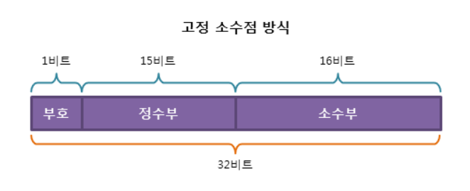
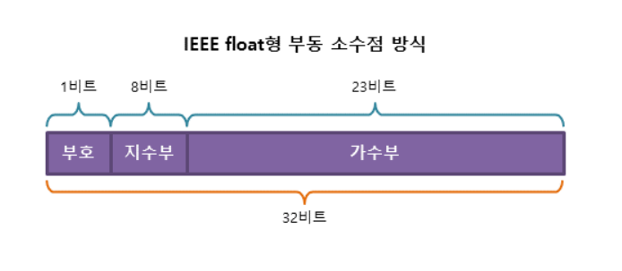

# Item 60 - 정확한 답이 필요하다면 float와 double은 피하라

## **float과 double 타입을 피해야 하는 이유**

```java
@Test
void 부동소수점_연산() {
		double a = 1.03, b = 0.42;
		double result = a - b;
		System.out.println(result); // 0.6100000000000001
		assertThat(result).isNotEqualTo(0.61);
}
```

- 위와 같은 단순한 계산에서도 오차가 발생한다.
- 그 이유는 float과 double 타입은 **부동 소수점 방식**을 사용하기 때문이다.

## **고정 소수점과 부동 소수점**

정수를 2진수로 표현하는 것은 문제가 없다.

하지만 소수점을 포함한 실수를 표현할 때는 상황이 조금 달라진다.

소수점의 위치를 표현하고, 무엇이 정수 부분이고 무엇이 실수 부분인지 구분해야 하기 때문이다.

컴퓨터는 이를 위해 **고정 소수점 방식**과 **부동 소수점 방식**을 사용한다.

### **(1) 고정 소수점 방식**

소수점이 찍힐 위치를 미리 정해 놓고, 소수를 표현하는 방식이다. (정수 + 소수)

> -3.141592는 부호(-)와 정수부(3), 소수부(0.141592) 3가지 요소 필요하다.



**장점** : 실수를 정수부와 소수부로 표현하여 단순하다.

**단점** : 표현의 범위가 너무 적어서 활용하기 힘들다. (정수부는 15bit, 소수부는 16bit)

### **(2) 부동 소수점 방식**

실수를 가수부 + 지수부로 표현한다.

- 가수 : 실수의 실제 값 표현
- 지수 : 크기를 표현함. 가수의 어디쯤에 소수점이 있는지 나타냄.



**지수의 값에 따라 소수점이 움직이는 방식**을 활용한 실수 표현 방법이다.

즉, 소수점의 위치가 고정되어 있지 않는다.

**장점** : 표현할 수 있는 수의 범위가 넓어진다. (현재 대부분 시스템에서 활용 중)

**단점** : 오차가 발생할 수 있다.

## **정확한 계산을 위한 대안**

### **(1) BigDecimal 클래스 이용**

```java
@Test
void BigDecimal_계산() {
		BigDecimal a = new BigDecimal("1.03");
		BigDecimal b = new BigDecimal("0.42");
		BigDecimal result = a.subtract(b);
		System.out.println(result); // 0.61
}
```

- `double`형 대신 `BigDecimal` 객체를 사용하면 실수의 연산을 오차 없이 수행할 수 있다.
- 하지만 `BigDecimal`은 기본 타입보다 쓰기가 훨씬 불편하고, 느리다.

### **(2) int, long 정수형 타입을 이용한 해법**

```java
@Test
void 정수로_치환해서_계산() {
		double a = 1.03, b = 0.42;
		long aL = (int)(a * 100); // 각 숫자에 100 을 곱해서 소수부를 없애준 다음, 정수로 형변환
		long bL = (int)(b * 100);
		double result = (aL - bL) / 100.0; // 정수끼리 연산 후, 다시 100.0 나누기하여 실수로 형변환
		assertThat(result).isEqualTo(0.61);
}
```

- 이 방법은 정수 기본형을 사용하므로 연산도 정확하고, 빠르다.
- 하지만 다룰 수 있는 값의 크기가 제한되고, 소수점을 직접 관리해야 한다.
- 9자리 십진수 - `int`, 18자리 십진수 - `long` / 18자리 초과 시 - `BigDecimal`

## **💡 핵심 정리**

- 정확한 답이 필요한 계산에는 `float`나 `double`을 피하라.
- 소수점 추적은 시스템에 맡기고, 코딩 시의 불편함이나 성능 저하를 신경 쓰지 않겠다면 `BigDecimal`을 사용하라.
- BigDecimal은 8가지 반올림 모드를 제공하므로 반올림을 거의 완벽히 제어할 수 있다.
- 반면, 성능이 중요한데, 소수점을 직접 추적할 수 있고, 숫자가 그리 크지 않다면 `int`나 `long`을 사용하라.
