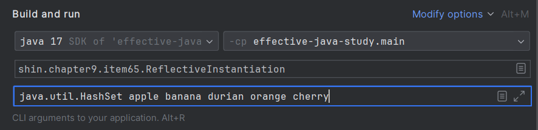
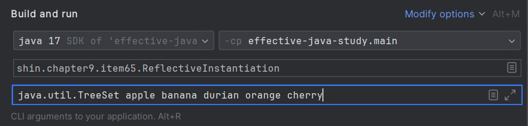

# Item 65 - 리플렉션보다는 인터페이스를 사용하라

## **리플렉션(java.lang.reflect)의 기능**

- 특정 클래스의 생성자, 메서드, 필드 정보를 가져올 수 있다.
    - 추가적으로 멤버 이름, 필드 타입, 메서드 시그니처 등을 가져올 수 있다.
    - 실제 생성자, 메서드, 필드를 조작할 수 있다.
    - `Method.invoke()`는 메서드를 호출할 수 있게 해준다.
- 컴파일 당시에 존재하지 않던 클래스도 이용할 수 있다.

## **리플렉션의 단점 🤔**

- 컴파일 타임 **타입 검사**의 이점을 누릴 수 없다.
    - 런타임에서야 오류를 알게 될 것이다.
- 코드가 지저분하고 장황해진다.
- 성능이 떨어진다.
    - 리플렉션을 통한 메서드 호출은 일반 메서드 호출보다 훨씬 느리다.

> 코드 분석 도구나 IOC 컨테이너인 스프링 프레임워크처럼 리플렉션을 써야하는 복잡한 애플리케이션이 몇 있지만 이런 도구들마저 리플렉션 사용을 점차 줄이고 있다.

> 리플렉션은 아주 제한된 형태로만 사용해야 단점을 피하고 이점만 취할 수 있다.


### **리플렉션 테스트코드 작성**
```java
// 리플렉션으로 활용한 인스턴스화 데모
public class ReflectiveInstantiation {
    // 리플렉션으로 생성하고 인터페이스로 참조해 활용한다.
    public static void main(String[] args) {
        // 클래스 이름을 Class 객체로 변환
        Class<? extends Set<String>> cl = null;
        try {
            cl = (Class<? extends Set<String>>)  // 비검사 형변환!
                    Class.forName(args[0]);
        } catch (ClassNotFoundException e) {
            fatalError("클래스를 찾을 수 없습니다.");
        }

        // 생성자를 얻는다.
        Constructor<? extends Set<String>> cons = null;
        try {
            cons = cl.getDeclaredConstructor();
        } catch (NoSuchMethodException e) {
            fatalError("매개변수 없는 생성자를 찾을 수 없습니다.");
        }

        // 집합의 인스턴스를 만든다.
        Set<String> s = null;
        try {
            s = cons.newInstance();
        } catch (IllegalAccessException e) {
            fatalError("생성자에 접근할 수 없습니다.");
        } catch (InstantiationException e) {
            fatalError("클래스를 인스턴스화할 수 없습니다.");
        } catch (InvocationTargetException e) {
            fatalError("생성자가 예외를 던졌습니다: " + e.getCause());
        } catch (ClassCastException e) {
            fatalError("Set을 구현하지 않은 클래스입니다.");
        }

        // 생성한 집합을 사용한다.
        s.addAll(Arrays.asList(args).subList(1, args.length));
        System.out.println(s);
    }

    private static void fatalError(String msg) {
        System.err.println(msg);
        System.exit(1);
    }
}
```
- 클래스 경로 문자열을 통해 해당 클래스를 가져오고, 가져온 클래스를 조작할 수 있다.
- 위 코드는 `Set`을 통해 문자열을 다뤄봤다. (`HashSet`, `TreeSet`테스트)

**`java.util.HashSet` 의 결과**

**RunConfiguration:**  java.util.HashSet apple banana durian orange cherry

```bash
[banana, orange, apple, cherry, durian]
```
- 무작위 순서로 출력한다.

**`java.util.TreeSet`의 결과**

**RunConfiguration**: java.util.TreeSet apple banana durian orange cherry

```bash
[apple, banana, cherry, durian, orange]
```
- 알파벳 순서로 출력한다.

### **예제에서 보는 리플렉션의 단점 🤔**
- 런타임에 6가지 예외가 발생 가능하다.
    - 제대로 예외처리를 한다면 고려할 점이 너무 많을 수 있다.
    - 다만 자바 7부터 `ReflectiveOperationException`로 리플렉션 예외를 잡을 수 있다.
- 클래스 이름만으로 클래스를 생성하기 위해서는 25줄의 코드를 작성해야 한다.
    - 일반 자바코드를 쓰는 것보다 압도적으로 코드가 많다.

## **💡 핵심 정리**
- 리플렉션은 복잡한 특수 시스템을 개발할 때 필요한 강력한 기능이지만 단점도 많다.
- 컴파일 시점에 이용할 수 없는 클래스를 사용해야 하는 경우, 리플렉션을 사용해야 한다.
- 단, 되도록 객체 생성에만 사용하고 생성한 객체를 이용할 때는 적절한 인터페이스나 컴파일 타임에 알 수 있는 상위 클래스로 형변환해 사용하자.
