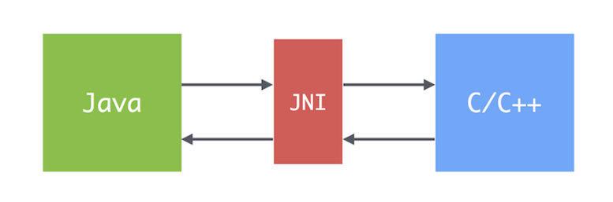

# Item 66 - 네이티브 메서드는 신중히 사용하라

## **자바 네이티브 인터페이스(Java Native Interface, JNI)란?**



- 자바 프로그램이 네이티브 메서드를 호출하는 기술
- 네이티브 메서드란, C나 C++같은 네이티브 프로그래밍 언어로 작성한 메서드

## **네이티브 메서드가 주로 쓰이는 곳 🔎**

### **(1) 레지스트리 같은 플랫폼 특화 기능**
- 자바가 성숙해지면서 (OS 같은) 하부 플랫폼의 기능을 점차 흡수하고 있다. 그래서 네이티브 메서드를 사용할 필요가 계속 줄어들고 있다.
- ex) 자바 9는 새로 `processAPI`를 추가하여 OS 프로세스에 접근할 수 있도록 하였다.

```java
public class JavaProcess {
    public static void main(String[] args) {
        ProcessHandle processHandle = ProcessHandle.current();

        System.out.println(ProcessHandle.of(processHandle.pid()).orElse(null));
        System.out.println("Native process ID of the process: " + processHandle.pid()); // process id
        System.out.println("\nDirect children: " + processHandle.children());
        System.out.println("\nClass name: " + processHandle.getClass());
        System.out.println("\nAll processes: " + ProcessHandle.allProcesses());
        System.out.println("\nProcess info: " + processHandle.info());
        System.out.println("\nIs process alive: " + processHandle.isAlive());
        System.out.println("\nProcess's parent " + processHandle.parent());

        //Process snapshot of the current running process with ProcessHandle.Info:
        ProcessHandle.Info processInfo = processHandle.info();

        System.out.println("\nProcess snapshot of the current running process:");
        System.out.println("User : " + processInfo.user().get());
        System.out.println("Start Time : " + processInfo.startInstant().get());
    }
}
```

### **(2) 네이티브 코드로 작성된 기존 라이브러리 사용**
- 대체할 만한 자바 라이브러리가 없을 경우, 네이티브 메서드를 써야 한다.

### **(3) 성능 개선을 목적으로 성능에 영향을 미치는 영역만 네이티브 언어로 작성하는 경우**
- 성능 개선을 목적으로 네이티브 메서드를 사용하는 것은 권장하지 않는다.
- JVM이 엄청난 속도로 발전하여 현재 자바는 다른 플랫폼에 견줄만한 성능을 보인다.

## **네이티브 메서드의 단점 🤔**

### **(1) 메모리 훼손 오류**
- 네이티브 언어가 안전하지 않으므로 네이티브 메서드를 사용하는 어플리케이션도 메모리 훼손 오류로부터 더 이상 안전하지 않다.
- 가비지 컬렉터가 네이티브 메모리는 자동 회수하지 못하고, 심지어 추적조차 할 수 없다.

### **(2) 이식성**
- 네이티브 언어는 자바보다 플랫폼을 많이 타서 이식성도 낮고, 디버깅도 더 어렵다.

### **(3) 성능과 비용, 가독성**
- 주의하지 않으면 속도가 오히려 느려질 수 있다.
- 자바 코드와 네이티브 코드의 경계를 넘나들 때마다 비용도 추가된다.
- 네이티브 메서드와 자바 코드 사이의 '접착 코드(glue code)'를 작성해야 하는데, 이는 귀찮은 작업이거니와 가독성도 떨어진다.

## **💡 핵심 정리**
- 네이티브 메서드를 사용하려거든 한번 더 생각하라. 네이티브 메서드가 성능을 개선해주는 일은 많지 않다.
- 저수준 자원이나 네이티브 라이브러리를 사용해야만 해서 어쩔 수 없더라도 네이티브 코드는 최소한만 사용하고 철저히 테스트하라.
- 네이티브 코드 안에 숨은 단 하나의 버그가 어플리케이션 전체를 훼손할 수도 있다.

## **참고**
https://www.baeldung.com/java-process-api

https://geekytheory.com/introduccion-a-java-native-interface/
